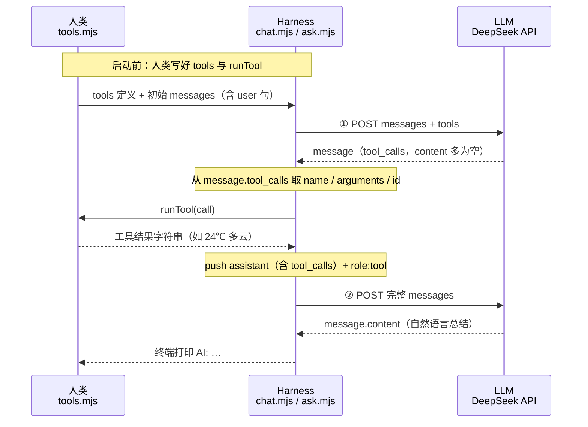

# 第 7 课 · Tool Calls

**约 25 分钟** · 第 6 课之后：模型**只负责说「要调哪个函数、参数是什么」**；**真正执行函数的是你的代码**。

演示句写死为 `杭州天气怎么样？`，`npm run ch07` 即可，无需输入。  
官方对照：[Tool Calls](https://api-docs.deepseek.com/guides/tool_calls)

---

## 先记住四件事

| 谁做 | 做什么 |
|------|--------|
| **你写** | `tools` 数组（函数名 + 参数 JSON Schema） |
| **模型出** | `message.tool_calls`（要调什么、参数 JSON **字符串**） |
| **你执行** | 根据 `name` / `arguments` 跑本地函数，得到字符串结果 |
| **你再请求** | 把 assistant（含 `tool_calls`）+ `role: tool` 结果塞回 `messages`，模型才用自然语言总结 |

模型**不会**帮你查天气；它只会生成类似 `get_weather({"location":"杭州"})` 的**调用意图**。

---

## 三方角色与时序

本课里三个角色分工如下（Agent 里常见叫法）：

| 角色 | 本课对应 | 职责 |
|------|----------|------|
| **人类** | `tools.mjs` + 你写的业务逻辑 | 定义 `tools` 长什么样；**真正执行** `get_weather`（查表、调 API 等） |
| **LLM** | DeepSeek `chat/completions` | 读 `messages` + `tools`，决定回复正文还是发出 `tool_calls`；**不跑你的函数** |
| **Harness** | `chat.mjs` + `ask.mjs` | 编排循环：发请求、解析 `message`、调用 `runTool`、拼 `messages`、再发请求、打印结果 |

下面是一次 Tool Call 演示（`npm run ch07`）的时序：虚线框内可能发生 **多轮**「LLM 要工具 → Harness 转给人类执行 → 再问 LLM」，本课只有 **一轮**工具（API 共 2 次）。



对应代码：

- **Harness** 发请求：`ask.mjs` 的 `complete()`；拼历史、循环：`chat.mjs` 的 `while (message.tool_calls?.length)`  
- **LLM** 输出字段：`data.choices[0].message`（`tool_calls` / `content`）  
- **人类** 执行：`tools.mjs` 的 `runTool()`（内部 `JSON.parse(call.function.arguments)`）

---

## 怎么做（四步）

```
① 组装 messages（system + user）
② POST /chat/completions，body 里带 messages + tools
③ 读 choices[0].message —— 若有 tool_calls，就执行 runTool，push tool 消息
④ 再 POST 一次（messages 已含工具结果）—— 读 message.content 打印 AI:
```

本课固定演示会走满 **② → ③ → ④**（API 调 **2 次**）。

---

## ① 怎么写：告诉模型有哪些函数

写在 [`tools.mjs`](https://github.com/SyncLionPaw/bagent/blob/main/lessons/07-tool-calls/tools.mjs)，请求时原样放进 body 的 `tools`：

```javascript
export const tools = [
  {
    type: "function",
    function: {
      name: "get_weather",                    // 函数名，后面 runTool 要靠它对上
      description: "查询某地天气。用户需先给出地点。",
      parameters: {                          // JSON Schema，模型按这个填参数
        type: "object",
        properties: {
          location: { type: "string", description: "城市名，如杭州、北京" },
        },
        required: ["location"],
      },
    },
  },
];
```

[`ask.mjs`](https://github.com/SyncLionPaw/bagent/blob/main/lessons/07-tool-calls/ask.mjs) 里和 `messages` 一起发给 API：

```javascript
body: JSON.stringify({
  model: "deepseek-v4-flash",
  messages,
  tools,                      // ← 来自 tools.mjs
  thinking: { type: "disabled" },
}),
```

---

## ② 从哪里拿：模型输出的函数调用字段

`complete()` 返回的是 **`data.choices[0].message`**（整段 `message` 对象），不是顶层的 `toolcall`。

第一次请求后，若要调工具，字段在这里：

| 你要用的 | 在响应里的路径 | 类型 / 说明 |
|----------|----------------|-------------|
| 有没有工具调用 | `message.tool_calls` | 数组；有长度就表示要调工具 |
| 本次调用的 id | `message.tool_calls[i].id` | 字符串；回传 `tool` 消息时必须带上 |
| 调哪个函数 | `message.tool_calls[i].function.name` | 如 `"get_weather"` |
| 参数是什么 | `message.tool_calls[i].function.arguments` | **JSON 字符串**，如 `'{"location":"杭州"}'` |
| 正文（此时常为空） | `message.content` | 调工具时多为 `null` |
| 是否因工具结束 | `data.choices[0].finish_reason` | 常为 `"tool_calls"` |

示例（节选）：

```json
{
  "choices": [{
    "finish_reason": "tool_calls",
    "message": {
      "role": "assistant",
      "content": null,
      "tool_calls": [{
        "id": "call_xxxxxxxx",
        "type": "function",
        "function": {
          "name": "get_weather",
          "arguments": "{\"location\":\"杭州\"}"
        }
      }]
    }
  }]
}
```

代码里对应关系：

```javascript
const data = await res.json();
const message = data.choices[0].message;   // ← 从这里拿

message.tool_calls[0].function.name;       // "get_weather"
message.tool_calls[0].function.arguments;  // '{"location":"杭州"}'
message.tool_calls[0].id;                  // "call_xxxxxxxx"
```

调试：`DEBUG=1 npm run ch07` 会在终端打印完整 `message`。

---

## ③ 怎么执行：你的 `runTool`

仍在 `tools.mjs`——**根据模型给的 `name` + `arguments` 跑本地逻辑**：

```javascript
export function runTool(call) {
  const { location } = JSON.parse(call.function.arguments);  // 先 parse 参数字符串
  return weather[location] ?? `（演示）${location}：晴 20℃`;   // 返回字符串给模型看
}
```

要点：

1. `arguments` 一定是 **字符串**，先 `JSON.parse` 再取字段。  
2. 用 `call.function.name` 判断调哪个函数（本课只有一个 `get_weather`）。  
3. 返回值是**普通字符串**（如 `"24℃ 多云"`），不是 JSON 对象。

[`chat.mjs`](https://github.com/SyncLionPaw/bagent/blob/main/lessons/07-tool-calls/chat.mjs) 里对每个 `tool_calls` 项执行：

```javascript
for (const call of message.tool_calls) {
  const result = runTool(call);
  console.log(`[工具] ${call.function.name}(${call.function.arguments}) → ${result}`);
  messages.push({
    role: "tool",
    tool_call_id: call.id,    // 必须和上面的 id 一致
    content: result,          // 你执行完的结果
  });
}
```

---

## ④ 怎么回传：拼好 messages 再请求一次

模型第一次返回 `tool_calls` 后，**必须把下面两类消息都 push 进 `messages`**，再 `complete(messages)`：

```javascript
// A. 模型那一轮 assistant（含 tool_calls，原样带回）
messages.push({
  role: "assistant",
  content: message.content,
  tool_calls: message.tool_calls,
});

// B. 你执行工具后的结果（每个 call 一条）
messages.push({
  role: "tool",
  tool_call_id: call.id,
  content: result,
});
```

第二次 `complete` 后，`message.tool_calls` 通常为空，直接读 **`message.content`** 就是最终回答：

```javascript
console.log("AI:", message.content);
```

---

## 完整代码脉络（[`chat.mjs`](https://github.com/SyncLionPaw/bagent/blob/main/lessons/07-tool-calls/chat.mjs)）

```javascript
const user = "杭州天气怎么样？";
const messages = [
  { role: "system", content: "查天气时调用 get_weather…" },
  { role: "user", content: user },
];

let message = await complete(messages);          // 第 1 次 API

while (message.tool_calls?.length) {             // 有 tool_calls 就执行
  messages.push({ role: "assistant", content: message.content, tool_calls: message.tool_calls });
  for (const call of message.tool_calls) {
    const result = runTool(call);                // 你执行
    messages.push({ role: "tool", tool_call_id: call.id, content: result });
  }
  message = await complete(messages);            // 第 2 次 API
}

console.log("AI:", message.content);
```

---

## 运行

```bash
npm run ch07
```

预期顺序：

```text
你: 杭州天气怎么样？
[工具] get_weather({"location":"杭州"}) → 24℃ 多云
AI: …（根据工具结果组织的自然语言）
```

---

## 检查点

- [ ] `tools` 是否写在请求 body 里？  
- [ ] 是否从 **`choices[0].message.tool_calls`** 取 `name` / `arguments` / `id`？  
- [ ] `arguments` 是否 `JSON.parse` 后再用？  
- [ ] 是否 `push` 了带 `tool_calls` 的 assistant + `role: tool`（含 `tool_call_id`）？  
- [ ] 第二次请求后才打印最终 `AI:`？  

## 下一课

[第 8 课 · 里程碑：你的第一个问答 Agent](/chapters/08-qa-agent) — 三工具 + 多轮，建议玩够再往下

[← 第 6 课](/chapters/06-functions)
