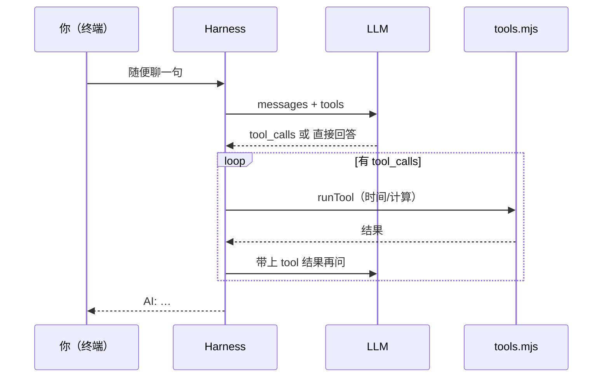

# 第 8 课 · 里程碑：你的第一个问答 Agent 🎉

**约 30 分钟** · **课程检查点** — 跑起来一个能**看表、能算数**、能一直聊的 Agent（无联网搜索）。

前几课像练基本功：请求、多轮、system、函数封装、Tool Calls 字段。  
**这一课像第一次组装整机** — 跑 `npm run ch08`，在终端里和它聊几句，你会直观感到：**我也能做出有意思的东西**。

---

## 你现在能做什么（先玩再读代码）

```bash
export DEEPSEEK_API_KEY=sk-...
npm run ch08
```

只需 **`DEEPSEEK_API_KEY`**。建议**真的问 3～5 句**再往下看代码：

| 玩什么 | 你可能会看到 |
|--------|----------------|
| `现在几点？顺便说句适合打工人自嘲的话` | `[工具] get_time` → 带时间的回复 |
| `帮我算 (99+1)*37-42` | `[工具] calculate` → 数字 + 解释 |
| `月薪 15000 扣 10% 税还剩多少？` | `[工具] calculate` |
| `现在几点？再算一下距离 18:00 下班还有几小时` | **连续两个工具** |

终端里出现 `[工具] xxx → …` 时，就是模型在「派活」，你的代码在「真干活」。

---

## 为什么这是检查点

```
第 1–5 课  →  模型会「说话」
第 6 课    →  代码变整齐（函数封装）
第 7 课    →  模型会「伸手要工具」
第 8 课    →  工具 + 多轮 = 能陪你聊的 Agent  ← 你在这里
```

学完本课，你可以理直气壮地说：

- 我写过 **带工具的对话循环**（Harness）  
- 我接通过 **时间 / 计算** 两个工具  
- 我能在终端里 **连续追问**，而不是一次性脚本  

下一课起会陆续加联网、流式等；**第 8 课是当前阶段的 Agent 检查点**，后面章节在此基础上扩展。

---

## 它是什么（技术上一句话）

**第 6 课的多轮终端** + **第 7 课的 Tool Calls 循环** + **两个工具**。

| 角色 | 文件 | 干什么 |
|------|------|--------|
| 你（终端） | — | 提问、看 `[工具]` 日志、看 `AI:` |
| Harness | `chat.mjs` `ask.mjs` | 编排请求与历史 |
| LLM | DeepSeek | 决定调哪个工具 |
| 人类代码 | `tools.mjs` | **真正执行** 看表、算式 |



---

## 两个工具

| 工具 | 玩家感受 | 实现 |
|------|----------|------|
| `get_time` | 「它知道现在几点」 | 本机时间 + 上海时区 |
| `calculate` | 「它真的会算」 | 本机算式（仅允许数字与 `+-*/()`） |

[`tools.mjs`](https://github.com/SyncLionPaw/bagent/blob/main/lessons/08-qa-agent/tools.mjs) — 想加掷骰子、单位换算？照葫芦画瓢加 `function` 和 `runTool` 分支，**不用改 Harness**。

---

## 核心代码（其实很短）

[`chat.mjs`](https://github.com/SyncLionPaw/bagent/blob/main/lessons/08-qa-agent/chat.mjs) 里就是两层循环，你已经在第 6、7 课见过零件：

```javascript
while (true) {
  const user = await rl.question("你: ");
  let message = await complete(messages);
  while (message.tool_calls?.length) {
    // runTool → push tool → 再 complete
  }
  console.log("AI:", message.content);
}
```

---

## 玩腻了之后

1. **`tools.mjs`** — 多加一个工具函数  
2. **`chat.mjs` 的 system** — 改人设，工具照旧  

第 9 课会说明：**不联网时模型对「最新版本」类问题容易幻觉**（训练截止日期），联网搜索用来补这一块。

---

## 检查点

- [ ] 是否至少有一次 `[工具] get_time` 或 `calculate`？  
- [ ] 是否试过**一句话里用两个工具**？  
- [ ] 心里是否有一句：「哦，这就是 Agent」？  

## 下一课

[第 9 课 · Tavily 联网搜索](/chapters/09-tavily)

[← 第 7 课](/chapters/07-tool-calls) · [第 6 课](/chapters/06-functions)
