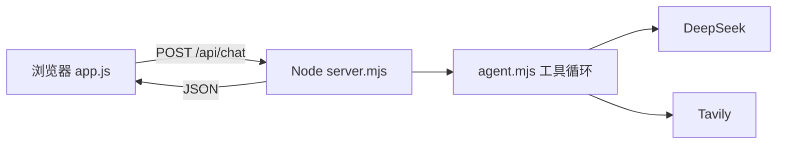

# 第 10 课 · 网页版 Agent（第一阶段完结）🎉

**约 40 分钟** · 第 9 课之后：把终端里的 Agent **搬进浏览器**

## 这一阶段你学到了什么

| 课 | 能力 |
|----|------|
| 1–5 | 会调 API、多轮、system |
| 6–7 | 函数封装、Tool Calls |
| 8 | 终端 Agent：`get_time` + `calculate` |
| 9 | 加上 `web_search`（Tavily） |
| **10** | **同一套逻辑 + 网页聊** ← 第一阶段终点 |

终端版（第 8、9 课）适合调试；网页版更像日常用的 ChatGPT / Cursor 聊天窗。  
**Harness 还是 Node**，只是「你」从 `readline` 换成了 **HTML + `fetch`**。

## 架构（多了一层，核心循环没变）



要点：

- **`ask.mjs` / `tools.mjs`** 与第 9 课相同，仍在**服务端**跑  
- **`DEEPSEEK_API_KEY`、`TAVILY_API_KEY` 只放在环境变量里**，不要写进 `public/app.js`  
- 浏览器只发 `messages`、收最终回复和工具摘要

## 文件分工

| 文件 | 作用 |
|------|------|
| `server.mjs` | 静态页面 + `POST /api/chat` |
| `agent.mjs` | 从 `chat.mjs` 抽出的单轮 Agent 循环 |
| `ask.mjs` / `tools.mjs` | 与第 9 课一致 |
| `public/index.html` | 聊天界面 |
| `public/app.js` | 发请求、渲染气泡 |
| `public/style.css` | 样式 |

## 运行

```bash
export DEEPSEEK_API_KEY=sk-...
export TAVILY_API_KEY=tvly-...
npm run ch10
```

终端会打印 `http://localhost:3100`（可用 `PORT=3200 npm run ch10` 改端口）。  
在浏览器打开，试几句：

- `现在几点？用一句话吐槽周一`  
- `帮我算 (99+1)*37-42`  
- `搜一下 DeepSeek 最近有什么新模型`

工具调用以小字显示在回复上方，类似终端里的 `[工具]` 日志。

## server.mjs 在干什么

1. `GET /` → 读 `public/` 里的静态文件  
2. `POST /api/chat` → 读 JSON 里的 `messages`，调用 `runTurn(messages)`，返回：

```json
{
  "content": "助手最终回复",
  "tools": [{ "name": "web_search", "arguments": "...", "preview": "..." }],
  "messages": [ "...完整历史含 tool 消息..." ]
}
```

前端用返回的 `messages` 覆盖本地数组，这样**多轮对话**时 tool 记录不会丢（和第 4 课「带历史」同一道理）。

## 和第 9 课终端版的对比

| | 第 9 课 `chat.mjs` | 第 10 课 |
|--|-------------------|----------|
| 输入 | `readline` | 单行输入 + 按钮 |
| 输出 | `console.log` | DOM 气泡 |
| 工具日志 | 终端 `[工具]` | 页面灰色条 |
| API Key | 本机环境变量 | 仍在 Node，不进浏览器 |

## 检查点

- [ ] `npm run ch10` 后浏览器能打开页面吗？  
- [ ] Key 是否只配在终端环境变量，没有写进 `public/`？  
- [ ] 问搜索类问题时页面是否出现 `web_search` 工具条？  
- [ ] 刷新页面后历史会清空——这是本课故意保持简单；持久化留到后面章节  

## 下一阶段

第一阶段到这里：**你会写 Agent 循环，会接工具，会在网页里用起来**。  
[第 11 课](/chapters/11-inference) 起进入**第二阶段**。本课网页仍等非流式整包 JSON（「思考中…」久、无打字机）——[第 14–15 课](/chapters/14-fastapi-stream) 假数据流 + SSE 解析，[第 16 课](/chapters/16-streaming) 直连真 API。

[← 第 9 课](/chapters/09-tavily) · [第 11 课 · 推理服务 →](/chapters/11-inference)
