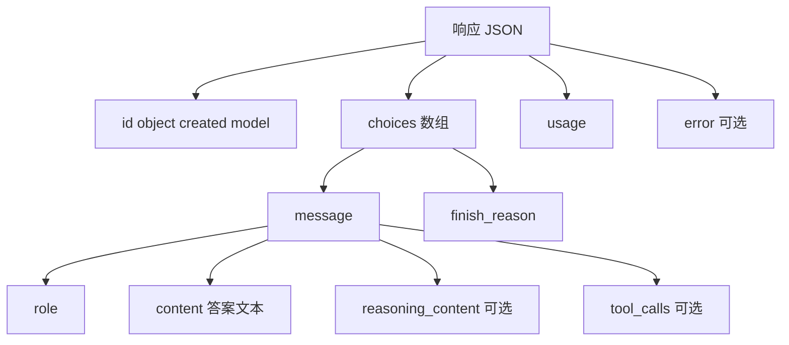

# 第 11 课 · 响应里除了答案还有什么

**约 25 分钟** · **第二部分开篇**（偏原理，几乎不增新代码）

## 第二阶段从哪开始

第 1–10 课你一直在写：

```javascript
const data = await res.json();
const message = data.choices?.[0]?.message;
console.log(message.content);  // 或 message.tool_calls
```

大家盯的都是 **`content` 那段中文**。  
本课把 **`res.json()` 整包** 摊开：推理服务还回了哪些字段、各自干什么、和 Agent 代码哪一行对应。

不讲预训练 / SFT / RL；也不先拆「权重怎么加载进 GPU」——那些留到后面章节。  
**今天就认清：一次 `chat/completions` 回来的一整份 JSON。**

---

## 整体长什么样

成功时，body 大致是：

```json
{
  "id": "chatcmpl-xxx",
  "object": "chat.completion",
  "created": 1710000000,
  "model": "deepseek-v4-flash",
  "choices": [ { "index": 0, "message": { ... }, "finish_reason": "stop" } ],
  "usage": { "prompt_tokens": 42, "completion_tokens": 18, "total_tokens": 60 }
}
```

失败时可能没有 `choices`，而是顶层 **`error`**（第 1 课见过 `choices` 为 `undefined` 的情况）。



---

## 顶层字段（和答案无关，但有用）

| 字段 | 常见值 | 干什么 |
|------|--------|--------|
| `id` | `chatcmpl-...` | 这一次生成的**请求 ID**，查账单、找客服、对日志时用 |
| `object` | `chat.completion` | 固定类型名，区分别的 API（如 embedding） |
| `created` | Unix 时间戳 | 服务**完成**这次生成的时间（秒） |
| `model` | 如 `deepseek-v4-flash` | 实际跑的那套模型（可能和你请求里的 `model` 一致，也可能是服务端解析后的名） |

你的 Harness **几乎不用读这些**，但调试时看一眼能确认「是不是打错模型 / 是不是同一次请求」。

---

## `choices`：真正干活的一层

`choices` 是**数组**。本课只用 **`choices[0]`**（`n=1` 时只有一条）。

| 字段 | 干什么 |
|------|--------|
| `index` | 第几条候选；`n>1` 时会多条，Agent 课一般 `n=1` |
| `finish_reason` | 生成**为什么停**（见下表） |
| `message` | **模型这一轮输出的消息对象**——Agent 代码的核心 |

### `finish_reason` 常见值

| 值 | 含义 |
|----|------|
| `stop` | 正常结束（遇到结束符或模型认为说完了） |
| `length` | 碰到 `max_tokens` 被截断 |
| `tool_calls` | 这一轮停在了「要调工具」，正文 `content` 常为空 |
| `content_filter` 等 | 被策略/审核拦截（厂商相关） |

第 7 课第一次 POST 后，经常是 **`finish_reason: "tool_calls"`** + `message.tool_calls` 有内容。

---

## `message`：不只有 `content`

```json
{
  "role": "assistant",
  "content": "你好，我是……",
  "tool_calls": null
}
```

| 字段 | 干什么 |
|------|--------|
| `role` | 固定 `"assistant"`，表示这条是模型说的 |
| `content` | **自然语言正文**——第 1–6 课你打印的就是它 |
| `tool_calls` | **第 7 课起**：模型「伸手」要调用的函数列表；有它时往往要先走工具循环，再第二次 POST |

`tool_calls` 里每一项大致是：

```json
{
  "id": "call_abc123",
  "type": "function",
  "function": {
    "name": "get_weather",
    "arguments": "{\"location\":\"杭州\"}"
  }
}
```

- `id`：你回传 `role: "tool"` 消息时必须带上 **`tool_call_id`**，和它对上  
- `function.arguments`：是 **JSON 字符串**，要自己 `JSON.parse`（第 7 课 `runTool` 里做过）

---

## 思考模式：`reasoning_content`（官方文档）

DeepSeek 在输出最终 `content` 之前，可以先输出一段**思维链**。  
请求里用（与第 1 课一致）：

```json
{
  "thinking": { "type": "enabled" },
  "reasoning_effort": "high"
}
```

关掉则写 `"type": "disabled"`（第 7 课起 Agent 示例里常用，见下）。

官方说明：[思考模式 | DeepSeek API Docs](https://api-docs.deepseek.com/zh-cn/guides/thinking_mode)

### 响应里多出来的字段

思考模式开启时，`choices[0].message` 里除了 `content`，还会有与 **`content` 同级** 的：

```json
{
  "role": "assistant",
  "reasoning_content": "先比较 9.11 和 9.8 的大小……",
  "content": "9.11 更大。",
  "tool_calls": null
}
```

| 字段 | 干什么 |
|------|--------|
| `reasoning_content` | 模型**内部推理过程**（思维链），不一定展示给用户 |
| `content` | 仍是对外的那句**最终回答** |

`npm run ch11` 时 `peek.mjs` 默认 **开启** thinking，方便你在整包 JSON 里看到 `reasoning_content`；`usage.completion_tokens` 往往也会比关掉时更大。

### 请求侧还要注意什么

按官方文档，思考模式下 **`temperature`、`top_p` 等采样参数不生效**（传了也不会报错，只是被忽略）。本课 `peek` 未传这些参数。

### 多轮对话里要不要带回 `reasoning_content`？

| 场景 | 下一轮 `messages` 里要不要带上一轮的 `reasoning_content` |
|------|--------------------------------------------------------|
| 两个 `user` 之间，**没有**工具调用 | **不必**；传了也会被 API 忽略 |
| 两个 `user` 之间，**有**工具调用 | **必须**完整回传，否则可能 **400** |

因此第 7–10 课 Agent 若关掉 thinking，Harness 只需处理 `content` / `tool_calls`；若你以后在 Agent 里**开着思考 + Tool Calls**，`messages.push` assistant 时要像官方样例一样带上整段 `message`（含 `reasoning_content`），或等价地：

```javascript
messages.push({
  role: "assistant",
  content: message.content,
  reasoning_content: message.reasoning_content,
  tool_calls: message.tool_calls,
});
```

流式时思维链走 `delta.reasoning_content`，最终答案仍走 `delta.content`（[第 16 课](/chapters/16-streaming)）。

---

## `usage`：token 账单

```json
"usage": {
  "prompt_tokens": 120,
  "completion_tokens": 45,
  "total_tokens": 165
}
```

| 字段 | 干什么 |
|------|--------|
| `prompt_tokens` | 你这次送进去的上下文（含 system、历史、tools 描述）占了多少 token |
| `completion_tokens` | 模型**新生成**了多少 token |
| `total_tokens` | 上面两者之和；按量计费时看这个 |

Agent **每多一轮对话、`messages` 越长，`prompt_tokens` 越大**——所以后面会讲上下文窗口与裁剪；本课先建立「钱和长度跟 token 走」的概念。

---

## 失败时：`error` 而不是 `choices`

```json
{
  "error": {
    "message": "Invalid API key",
    "type": "authentication_error",
    "code": "invalid_api_key"
  }
}
```

第 9 课还见过业务类提示（如 **Content Exists Risk**）：有时 HTTP 仍是 200，但 `choices` 为空、`error` 有说明。  
所以 Harness 里要写：

```javascript
const message = data.choices?.[0]?.message;
if (message) return message;
// 再读 data.error …
```

（第 8、9 课 `ask.mjs` 已按这个思路兜底。）

---

## 和你写过代码的对照

| 你写的 | 读的响应字段 |
|--------|----------------|
| `console.log(message.content)` | `choices[0].message.content` |
| `while (message.tool_calls?.length)` | `choices[0].message.tool_calls` |
| `messages.push({ role: "tool", tool_call_id: call.id, ... })` | 用 `tool_calls[].id` 对齐 |
| `messages.push({ role: "assistant", content: message.content, tool_calls })` | 把整段 `message` 塞回历史 |
| 第 10 课 `data.content` | 你自己的 server 只转了 `content`；背后仍是上面的结构 |

**流式（[第 16 课](/chapters/16-streaming)）**：同一次生成，只是把 `message.content` 拆成很多个 `delta.content` 事件；`usage` 往往在**最后一包**才完整出现。

---

## 动手：把 `data` 整包打出来

[`peek.mjs`](https://github.com/SyncLionPaw/bagent/blob/main/lessons/11-inference/peek.mjs) 发请求时 **`thinking: enabled`**，再把 `data` 整包 **`JSON.stringify(data, null, 2)`** 打到终端。可把 `thinking` 改成 `disabled` 对比两次输出。

```bash
export DEEPSEEK_API_KEY=sk-...
npm run ch11
```

对照上文表格，在输出里自己找 `id`、`choices[0].finish_reason`、`usage`、`reasoning_content` 等字段；**不要只扫一眼 `content`**。

---

## 检查点

- [ ] 能说出 `choices[0].message` 和顶层 `id` / `usage` 各管什么吗？  
- [ ] 知道 `finish_reason` 为 `tool_calls` 时通常要先执行工具吗？  
- [ ] 知道 `tool_calls[].id` 为什么要写进 `role: "tool"` 消息吗？  
- [ ] 失败时除了看 `content`，还会看 `error` 或 `choices` 是否为空吗？  
- [ ] 开启 thinking 时，能区分 `reasoning_content` 与 `content` 吗？  

## 下一课

[第 12 课 · 本地极小模型推理](/chapters/12-local-inference)：用 `transformers` 下载 `tiny-gpt2`，在本机计时加载与 `generate`。

[← 第 10 课](/chapters/10-web-ui) · [DeepSeek 思考模式](https://api-docs.deepseek.com/zh-cn/guides/thinking_mode)
