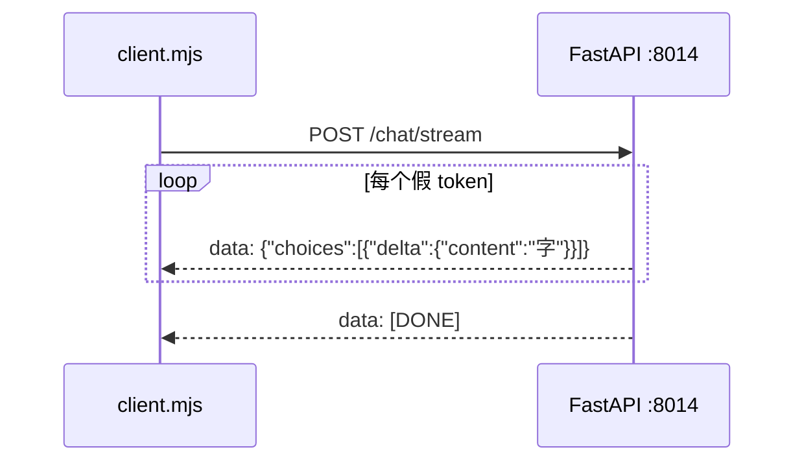

# 第 14 课 · FastAPI 假数据流式（SSE 实战）

**约 25 分钟** · 第 13 课之后 · **只演示流式推送与消费，不调大模型 API**

## 本课在干什么

第 10 课若网关 `await res.json()` 再一次性返回，前端就没有打字机——问题在 **会不会传递流**，不在模型聪不聪明。

本课用 **假数据** 把两件事拆清楚：

1. **服务端（FastAPI）**：用 `StreamingResponse` **一段一段** 写出 `text/event-stream`  
2. **客户端（Node `client.mjs`）**：`fetch` + `getReader()` **边收边解析** `data:` 行、边打印  

**不需要 `DEEPSEEK_API_KEY`，不需要联网调模型。**  
SSE 的形状故意做成和第 18 课 DeepSeek 流式相近（`choices[0].delta.content`），方便以后无缝换成真 API。

```text
client.mjs  →  POST /chat/stream  →  FastAPI 逐字 yield 假 JSON chunk
```

---

## 架构



| 文件 | 作用 |
|------|------|
| [`main.py`](https://github.com/SyncLionPaw/bagent/blob/main/lessons/14-fastapi-stream/main.py) | `async def generate(): yield` 多行 SSE |
| [`client.mjs`](https://github.com/SyncLionPaw/bagent/blob/main/lessons/14-fastapi-stream/client.mjs) | 消费流式响应，终端打字机 |
| `setup.sh` / `server.sh` | uv 优先的 venv |

---

## 环境

- Python **3.10+**
- 推荐 [uv](https://docs.astral.sh/uv/)（无则 `python3 -m venv`）

```bash
npm run ch14:setup
```

---

## 运行（两个终端）

**终端 1：**

```bash
npm run ch14:server
```

**终端 2：**

```bash
npm run ch14
```

默认会把**你发的 user 原文**当作假回复逐字吐出（所以打字内容就是你自己输入的那句）；未传则用内置说明文案。

看原始 SSE：

```bash
curl -N http://127.0.0.1:8014/chat/stream \
  -H "Content-Type: application/json" \
  -d '{"messages":[{"role":"user","content":"你好"}]}'
```

应看到多行 `data: {...}`，最后 `data: [DONE]`。

---

## 服务端：假数据怎么「流」出去

```python
async def generate():
    for char in text:
        yield sse_chunk(char)   # data: {"choices":[{"delta":{"content":"字"}}]}
        await asyncio.sleep(0.06)
    yield "data: [DONE]\n\n"

return StreamingResponse(generate(), media_type="text/event-stream")
```

对比**错误示范**（本课不要这样写）：

```python
# 拼完一整段再 return → 客户端仍然等一整包，没有打字机
return {"content": full_text}
```

官方：[FastAPI — StreamingResponse](https://fastapi.tiangolo.com/advanced/custom-response/#streamingresponse)

---

## 客户端：怎么「消费」流

[`client.mjs`](https://github.com/SyncLionPaw/bagent/blob/main/lessons/14-fastapi-stream/client.mjs) 里用 **手写** `getReader` + `buf` + `split("\n")` + `data:` 解析（为看清协议）。

**插播**：[第 15 课](/chapters/15-sse-parse) 对照 **手写 vs `eventsource-parser` 库**，同一假流两种读法。  
第 20 课再接真 DeepSeek API。

---

## 和第 10 课的关系

第 10 课网页 `/api/chat` 若一次性 `json()` 整包 Agent 结果，浏览器只能「思考中…」然后整段出现。  
本课说明：要在 **FastAPI / Node 网关** 层用 `StreamingResponse`（或等价）**持续写出**；前端 / `client.mjs` 用 **流式读**。  
接上真模型是第 20 课及以后改数据来源即可。

---

## 检查点

- [ ] 两个终端能跑通 `ch14:server` + `ch14` 吗？  
- [ ] `curl -N` 能看到**多行** `data:` 而不是一次一个大 JSON 吗？  
- [ ] 能说出 **StreamingResponse** 与「先拼完整再返回」的差别吗？  
- [ ] `client.mjs` 里是哪几行在 **边读边写**？  

## 下一课

[第 15 课 · SSE 解析对照](/chapters/15-sse-parse) → [第 18 课 · 协议与打字机](/chapters/18-streaming)。

[← 第 13 课](/chapters/13-inference-engines) · [FastAPI 文档](https://fastapi.tiangolo.com/)
