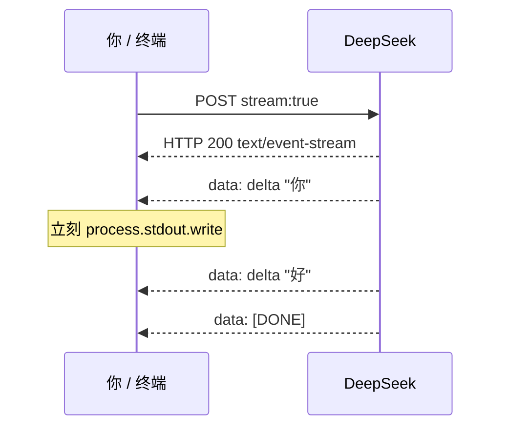

# 第 18 课 · 流式输出：先懂 SSE，再写打字机

**约 35 分钟** · **回到 JavaScript 主线** · [第 15 课 SSE 解析](/chapters/15-sse-parse) 之后

建议顺序：第 14 课（假数据 **发出** 流）→ 第 15 课（**手写 vs 库** 解析）→ **本课**（协议全文 + 浏览器打字机）。

---

## 1. 你想解决的两个体验问题

第 1–10 课（含 [第 10 课网页](/chapters/10-web-ui)）常见写法：

```javascript
const data = await res.json();
console.log(data.choices[0].message.content);
```

| 现象 | 原因（通俗） |
|------|----------------|
| **没有打字机**，整段突然蹦出 | 程序在等 **HTTP 响应体全部收完** 才解析 |
| **首字等很久**（TTFT 体感差） | 模型可能已在生成，但你要等 **整段 `content`** 才第一次 `console.log` |

要改体验，先要弄清：**服务端用什么协议、一截一截把字推过来**——本课核心是 **SSE**，不是再换一个 `fetch` 参数那么简单。

---

## 2. 三种常见的「客户端 ↔ 模型服务」形态

很多初学者会把它们混成一团。可以粗分为：

| 形态 | 一次交互长什么样 | 典型场景 |
|------|------------------|----------|
| **HTTP + 单 JSON 体** | 一个请求 → 响应体是**完整一个 JSON** | 第 6 课 `chat()`、`res.json()` |
| **JSON-RPC 2.0** | 一个请求 → 响应体是**一条** `{ jsonrpc, result, id }` | 部分网关、本地推理封装、工具链内部 RPC |
| **HTTP + SSE 流** | 一个请求 → 响应体**长时间不断**，多行 `data: ...` | OpenAI / DeepSeek `stream: true` |

下面分开说；**DeepSeek 流式补全走的是第三行（SSE）**，不是 JSON-RPC 流。

---

## 3. HTTP 单 JSON（第 6、11 课已在用）

```http
POST /chat/completions HTTP/1.1
Content-Type: application/json

{ "model": "...", "messages": [...] }
```

```http
HTTP/1.1 200 OK
Content-Type: application/json

{ "choices": [{ "message": { "content": "完整答案……" } }], "usage": {...} }
```

- 连接在**整段 JSON 发完后**就可以结束。  
- 客户端：`await res.json()` **一次**拿到全部字段（第 11 课拆过 `choices` / `usage`）。  
- **没有「中间状态」**，所以做不到打字机。

---

## 4. JSON-RPC 2.0 是什么（对照用，本课 API 不是它）

[JSON-RPC 2.0](https://www.jsonrpc.org/specification) 规定的是 **JSON 信封**，不是传输层：

**请求：**

```json
{
  "jsonrpc": "2.0",
  "method": "chat.complete",
  "params": { "messages": [] },
  "id": 1
}
```

**响应（仍通常是一次性 HTTP body）：**

```json
{
  "jsonrpc": "2.0",
  "result": { "content": "完整答案……" },
  "id": 1
}
```

特点：

- 强调 **`method` + `params` + `id`**，错误用 `error` 字段返回。  
- 常见实现仍是：**一次 HTTP 往返 → 一个 JSON 结果**（和非流式 REST 很像，只是形状不同）。  
- 若要做「边生成边推送」，需要**额外约定**（例如 WebSocket 上多条 JSON-RPC 通知、或改用 SSE）——**不是** JSON-RPC 规范里自带的标准流式模型。

所以：你听说「RPC」时，别自动当成「流式」；**大模型补全的流式 industry 标准做法是 SSE**（下一节）。

---

## 5. SSE：Server-Sent Events（本课重点）

### 5.1 它解决什么问题

需要 **服务器 → 浏览器/客户端 持续推送** 一小段一小段数据（例如每个 token），但**不需要**客户端频繁往服务器发数据（双向用 WebSocket 更多）。

SSE 建立在 **普通 HTTP** 上：一个长连接，响应体按**文本事件**格式不断写下。

规范与说明：

- [WHATWG / HTML — Server-sent events](https://html.spec.whatwg.org/multipage/server-sent-events.html)  
- [MDN — Server-sent events](https://developer.mozilla.org/zh-CN/docs/Web/API/Server-sent_events)

### 5.2 响应头长什么样

开启流式后，DeepSeek 等会返回类似：

```http
HTTP/1.1 200 OK
Content-Type: text/event-stream
Cache-Control: no-cache
Connection: keep-alive
```

`Content-Type: text/event-stream` 是识别 **「这是 SSE」** 的关键（而不是 `application/json` 一坨到底）。

### 5.3 响应体：按「行」组织的文本协议

SSE 消息由若干 **字段行** 组成，字段之间用 **空行** 分隔一条事件：

```text
data: {"choices":[{"delta":{"content":"你"}}]}

data: {"choices":[{"delta":{"content":"好"}}]}

data: [DONE]

```

常见字段（本课会碰到的加粗）：

| 字段 | 含义 |
|------|------|
| **`data:`** | 本条事件携带的数据（可多行 `data:`，会拼成一行） |
| `event:` | 事件类型名（可选；客户端可按类型分发） |
| `id:` | 事件 ID（可选；断线重连时 `Last-Event-ID`） |
| `retry:` | 建议重连间隔 ms（可选） |
| **空行** | 表示一条事件结束 |

大模型 API 的惯例：

- 每一行的 **`data:` 后面** 往往再放 **一小块 JSON**（一个 chunk）。  
- 结束时发 **`data: [DONE]`**（OpenAI 兼容生态约定，不是 SSE 规范强制，但大家都认）。

你在 Node 里用 `getReader()` 读到的二进制流，**解码成字符串后** 就是上面这种「很多行 `data: ...`」的文本；所以要 **按 `\n` 拆行**，再判断 `line.startsWith("data: ")`。

### 5.4 和 WebSocket 一句话对比

| | SSE | WebSocket |
|--|-----|-----------|
| 方向 | 主要是 **服务器 → 客户端** | **双向** |
| 协议 | 普通 HTTP，易过代理 | 升级协议 `ws://` |
| LLM 流式补全 | **极常见**（OpenAI 形态） | 也有，但本课程 DeepSeek 走 SSE |

第 10 课网页以后若要打字机，可以继续用 **`fetch` + ReadableStream 解析 SSE**（不必先上 WebSocket）。

### 5.5 大模型在 SSE 里塞的 JSON 长什么样

`stream: true` 时，每个 `data:` 里通常是一块 **chunk JSON**（注意字段名变化）：

```json
{
  "choices": [{
    "delta": { "content": "一个字或一个词" },
    "finish_reason": null
  }]
}
```

与非流式对照（第 11 课）：

| 非流式（一次 JSON） | 流式（很多个 `data:`） |
|--------------------|-------------------------|
| `choices[0].message.content` | 多次 `choices[0].delta.content` |
| 一次 `usage` 常在末尾 | `usage` 常在**最后一个** chunk |

官方字段说明：[Create Chat Completion — `stream`](https://api-docs.deepseek.com/api/create-chat-completion)

### 5.6 为什么 SSE 能改善 TTFT 体感



**首包 `data:` 到达的时间** ≈ 你第一次看到字的时间（TTFT 体感）。  
总生成时间可能和非流式接近，但用户不会对着空白屏干等整段 JSON。

---

## 6. 把协议落到代码：你要改的两处

读懂 SSE 之后，实现只有两步（文末 demo）：

1. **请求**：`body` 里加 `"stream": true`（告诉服务端用 `text/event-stream` 推 chunk）。  
2. **读响应**：不要用 `res.json()`；用 `res.body.getReader()` → 解码 → **按行解析 `data:`** → 取 `delta.content` → 边拼边 `write`。

这和 JSON-RPC、单 JSON 的 **`json()` 一次读完** 是三种不同的读法。

---

## 7. 动手：浏览器直连 DeepSeek（读完再做）

[`public/index.html`](https://github.com/SyncLionPaw/bagent/blob/main/lessons/18-streaming/public/index.html)：**一个 HTML**，`fetch` DeepSeek + `stream: true` + **内联** SSE 解析循环 + 聊天气泡。与第 19 课 UI 相同，但解析逻辑写在 `chat()` 里、不抽函数。

```bash
npm run ch18
# 或 open lessons/18-streaming/public/index.html
```

页顶填入 **API Key**（仅存 `sessionStorage`，刷新本页仍可用；**勿把 Key 写进 HTML 提交仓库**）。

对比建议：

```bash
npm run ch06   # 单 JSON：整段一次出现
npm run ch14   # 终端消费假 SSE（第 14 课）
npm run ch15:hand   # 只练解析（第 15 课）
# 本课：浏览器直开，真 API 流式
```

核心请求与读流：

```javascript
const res = await fetch("https://api.deepseek.com/chat/completions", {
  method: "POST",
  headers: { Authorization: `Bearer ${key}`, "Content-Type": "application/json" },
  body: JSON.stringify({ model: "deepseek-v4-flash", messages, stream: true }),
});
const reader = res.body.getReader();
// …按行 data: → delta.content → 更新气泡 textContent
```

**注意**：Key 在浏览器里谁都能看见（开发者工具），正式产品应把 Key 放在 [第 20 课](/chapters/20-web-stream-server) 的 Node 网关后面。第 19 课把上面的循环抽成 `consumeSSE`。

---

## 检查点

- [ ] 能说出 **单 JSON**、**JSON-RPC 2.0**、**SSE** 三者「一次交互」形态的差异吗？  
- [ ] 知道 DeepSeek 流式响应的 `Content-Type` 是 **`text/event-stream`** 吗？  
- [ ] 能解释一条 SSE 事件里 **`data:`** 行与空行的作用吗？  
- [ ] 知道流式正文在 **`delta.content`**，而不是 `message.content` 吗？  
- [ ] 能说出「打字机」和 **TTFT 体感** 为什么依赖「边读边写」吗？  

## 后续

- [第 22 课 · 正经 Agent 工程（第三阶段）](/chapters/22-agent-project)
- [第 17 课 · SSE 为什么火过、现在又安静了](/chapters/17-sse-landscape)（纯阅读，行业背景）  

[← 第 15 课 SSE 解析](/chapters/15-sse-parse) · [第 19 课 网页流式 →](/chapters/19-web-stream) · [第 17 课 行业背景 →](/chapters/17-sse-landscape) · [MDN SSE](https://developer.mozilla.org/zh-CN/docs/Web/API/Server-sent_events) · [JSON-RPC 2.0](https://www.jsonrpc.org/specification) · [DeepSeek stream](https://api-docs.deepseek.com/api/create-chat-completion)
