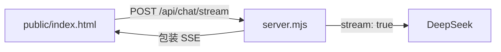

# 第 20 课 · Node 网页流式网关

**约 25 分钟** · [第 19 课](/chapters/19-web-stream) 之后

第 18–19 课在浏览器里直连 DeepSeek（Key 在页面里，适合练习）。本课加 Node 层：**代调模型、包装 SSE、Key 只放环境变量**。

---

## 架构



| 文件 | 作用 |
|------|------|
| `server.mjs` | 静态文件 + 代理流 |
| `public/index.html` | 页面，`fetch` 同源接口 |
| `public/style.css` | 样式 |

`consumeSSE` 与第 19 课相同；区别是 `fetch("/api/chat/stream")` 指向本机 Node。

---

## 动手

```bash
export DEEPSEEK_API_KEY=sk-...
npm run ch20
```

浏览器打开 `http://localhost:3020`。

---

## 检查点

- [ ] 能说出为什么 Key 不能写进 `public/index.html` 吗？  
- [ ] 能解释 `wrapSSE` 在代理里做了什么吗？  
- [ ] 对比第 19 课假流，真 API 多了哪一层？  

[← 第 19 课](/chapters/19-web-stream) · [第 21 课 浏览器与 Node →](/chapters/21-js-runtimes) · [第 17 课 行业背景 →](/chapters/17-sse-landscape)
