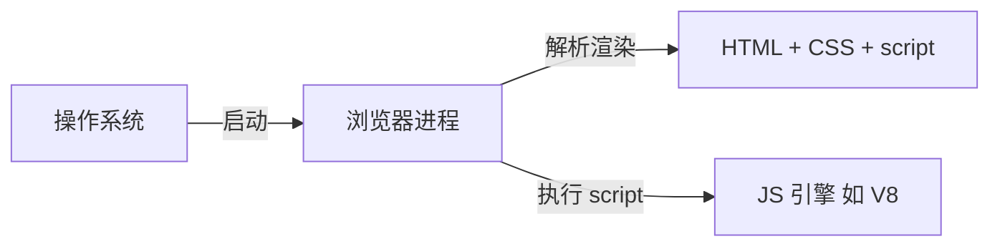
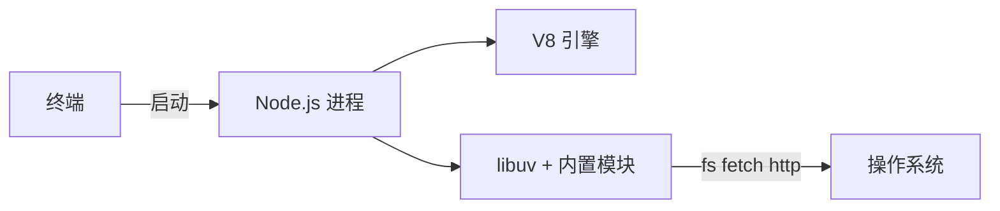

# 第 21 课 · 浏览器与 Node.js：为什么 HTML 能直开、`.mjs` 却要运行时？（扩展阅读）

**约 25 分钟** · 纯阅读 · [第 19–20 课](/chapters/19-web-stream) 之后

第 19 课 **`public/index.html` 双击就能跑**；第 1 课起 **`node xxx.mjs` 要先装 Node**。  
很多初学者会困惑：**都是 JavaScript，凭什么一个「打开就行」、一个「还要装运行时」？**

本课把这件事讲清楚，并顺带介绍 **Deno、Bun** 等较新的 JS 运行时。

---

## 1. 先纠正一个直觉

| 误解 | 更准确的说法 |
|------|----------------|
| 「HTML 不需要运行时」 | **需要**——只是运行时已经装在你电脑里了，叫 **浏览器** |
| 「JS 文件双击就能跑」 | **看宿主**：嵌在 HTML 里、由浏览器加载 → 能跑；磁盘上的 `server.mjs` → **没有默认宿主**，双击只会用编辑器打开或报关联错误 |
| 「浏览器和 Node 是两种语言」 | **同一种语言（ECMAScript）**，**不同的内置 API 与环境** |

你写的 `.mjs` / `.js **源码**本身不能自己执行——总要有一个 **宿主（host）** 来解析、编译（JIT）、调用 API。

---

## 2. 打开一个 HTML 文件时发生了什么

```bash
open lessons/19-web-stream/public/index.html
# 或 file:///Users/.../index.html
```

流程可以粗分为：



1. **操作系统** 按文件关联启动 **Chrome / Safari / Firefox** 等。  
2. **浏览器** 读 HTML，建 DOM，加载 CSS，遇到 `<script>` 交给 **JS 引擎**（Chrome 系多为 **V8**）。  
3. 脚本里能用 **`document`、`fetch`（有限制）、`localStorage`** 等——这些是 **浏览器提供的 Web API**，不是 JS 语法本身。

所以：**不是「HTML 免运行时」，而是「浏览器替你当了运行时 + UI 壳」**。

### 2.1 为什么第 19 课不必起 Node

[`public/index.html`](/chapters/19-web-stream) 里：

- **假数据** 用 `ReadableStream` 在页面内生成，**不请求外网**  
- **不读** `process.env`、**不写** 本地文件、**不监听** TCP 端口  

它用到的全是 **浏览器里本来就有的能力**，因此 `file://` 或双击即可。

一旦要 **藏 API Key**、**代理 DeepSeek**、**监听 3020 端口**，就超出了「纯页面」——需要 [第 20 课](/chapters/20-web-stream-server) 的 **Node 服务端**。

---

## 3. 运行 `node lessons/01-deepseek/deepseek.mjs` 时发生了什么

```bash
node lessons/01-deepseek/deepseek.mjs
```



1. **终端** 启动 **`node` 可执行文件**（Node.js 安装时带的）。  
2. Node 把 `.mjs` 交给内嵌的 **V8** 执行（与 Chrome 同系引擎，但**外壳不同**）。  
3. 脚本里可用 **`process`、`fs`、`http`** 等——这是 **Node 提供的 API**，浏览器里 **没有** `require`/`import fs` 那一套（除非 bundler 打补丁）。

**磁盘上的 `.mjs` 没有「默认关联程序」替你执行 JS**——你必须显式调用 `node`（或 Deno、Bun 等）。

---

## 4. 浏览器 vs Node：对照表

| 维度 | 浏览器 | Node.js |
|------|--------|---------|
| **主要用途** | 展示 UI、跑网页逻辑 | 脚本、CLI、HTTP 服务、工具链 |
| **谁启动** | 用户点链接 / 打开文件 | 你在终端敲 `node` |
| **典型全局对象** | `window`、`document` | `process`、`globalThis` |
| **网络** | `fetch`（受 **同源策略 / CORS** 约束） | `fetch`、 `http`/`https` 模块，**无 CORS** |
| **文件** | 几乎不能直接读用户磁盘（安全） | `fs` 读写任意路径（受 OS 权限约束） |
| **密钥** | 写进 JS = **谁都能看见** | 放 `process.env`，不发给浏览器 |
| **本课例子** | 第 10、19 课页面 | 第 1–9、18、20 课 `.mjs` |

**同一段语法**（`async/await`、`fetch`、箭头函数）两边都能跑；**换的是「能调哪些库、默认安全模型是什么」**。

### 4.1 为什么 Agent 课用 Node 当 Harness

[第 10 课](/chapters/10-web-ui) 架构图里：**浏览器只聊天，Agent 循环在 Node**——因为：

1. **`DEEPSEEK_API_KEY` 不能进 `public/`**  
2. **Tool Calls、读文件、起子进程** 更适合服务端  
3. 浏览器负责 **展示**；Node 负责 **编排与密钥**

第 20 课把 **流式** 也放回了 Node 网关，道理相同。

---

## 5. 「运行时」到底指什么

可以拆成三层理解：

| 层 | 是什么 | 例子 |
|----|--------|------|
| **语言** | ECMAScript 语法与语义 | `const`、`Promise`、`class` |
| **引擎** | 真正执行字节码 | **V8**、SpiderMonkey、JavaScriptCore |
| **运行时** | 引擎 + 标准库 + 事件循环 + I/O | **浏览器**、**Node.js**、**Deno**、**Bun** |

你说「需要一个运行时」，通常指 **第三层**——缺了它，只有磁盘上的文本，没有 `console.log` 的归宿，也没有 `fetch` 的实现。

---

## 6. 较新的 JavaScript 运行时（2025–2026 概览）

Node（2009 年起）仍是 **服务端 JS 事实标准**，但近几年多了几个 **「可替代 Node 的宿主」**：

| 运行时 | 一句话 | 和本课的关系 |
|--------|--------|----------------|
| **Node.js** | V8 + libuv；npm 生态最大 | **bagent 默认**；`npm run ch01` 等 |
| **Deno** | 默认 **TypeScript**、**权限沙箱**（读文件要 `--allow-read`）、标准库内置 | 可把本课 `.mjs` 改成 Deno 跑，思路相同 |
| **Bun** | 追求启动与安装速度；内置 bundler/test | 常作 Node **兼容替代**跑脚本 |
| **Cloudflare Workers** | 边缘 V8 **隔离**，无传统 `fs`，有 `fetch`/KV | 部署 **无服务器** 网关时代理 DeepSeek |
| **WinterCG** | 推动 **`fetch`、`Request`、`Response`** 跨运行时一致 | 第 19 课 `fetch` + `ReadableStream` 在 Node 20+ 也能用，即此趋势 |

不必现在全学。知道三点即可：

1. **语法 largely 共用**（ES 模块、`async/await`）  
2. **API 与部署形态不同**——Worker 没有完整 `fs`，Deno 默认更严  
3. **选 Node 的原因**通常是 **教程生态、npm 包、团队熟悉度**——不是唯一解

---

## 7. 和第 19、20 课的对照（串起来）

| 你做的 | 用的宿主 | 为什么 |
|--------|----------|--------|
| 双击 `public/index.html`（第 18、19 课） | **浏览器** | 页内填 Key，`fetch` 直连 DeepSeek |
| `npm run ch20` | **Node** | 监听端口、真 DeepSeek |

若把第 20 课改成 **Deno** 或 **Bun**，HTTP 代理逻辑可以几乎不变；变的是启动命令（`deno run`、`bun run`）和权限/配置方式。

---

## 8. 常见追问

**Q：`import` 的 `.mjs` 为什么浏览器里也要 `<script type="module">`？**  
A: 两边都实现了 **ES Module** 标准，但 **模块解析规则不同**——浏览器按 **URL** 找文件；Node 按 **文件路径** 找。浏览器不能直接 `import fs from "node:fs"`。

**Q：Vite / Webpack 算运行时吗？**  
A: **不算**。它们是 **构建工具**，把源码打包成浏览器能加载的 bundle；真正执行仍在浏览器或 Node 里。

**Q：Python 课（第 12、14 课）和 JS 运行时什么关系？**  
A: **完全另一套运行时**（CPython + transformers/FastAPI）。bagent 用 Python 演示 **推理与假流式**，JS 主线仍是 **Agent 与网关**。

---

## 检查点

- [ ] 能说出「HTML 能直开」是因为 **浏览器已是运行时** 吗？  
- [ ] 能区分 **JS 引擎** 与 **运行时（Node / 浏览器）** 吗？  
- [ ] 能解释为什么 API Key 应放在 **Node 环境变量** 而不是 HTML 吗？  
- [ ] 能举出除 Node 外 **一个** 新运行时（Deno / Bun / Workers）吗？  

## 相关章节

- [第 19 课 · 浏览器流式](/chapters/19-web-stream)  
- [第 20 课 · Node 网关](/chapters/20-web-stream-server)  
- [第 10 课 · 网页 Agent](/chapters/10-web-ui)  
- [第 17 课 · SSE 行业背景](/chapters/17-sse-landscape)  

[← 第 20 课](/chapters/20-web-stream-server) · [第 17 课 SSE 背景 →](/chapters/17-sse-landscape) · [Node.js 文档](https://nodejs.org/docs) · [MDN JavaScript](https://developer.mozilla.org/zh-CN/docs/Web/JavaScript) · [Deno](https://docs.deno.com/) · [Bun](https://bun.sh/docs)
