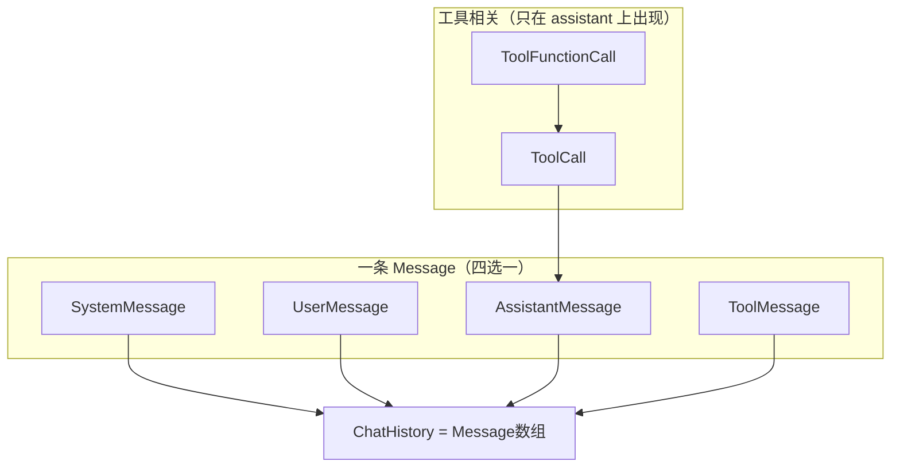

# 第 23 课 · Agent 的 messages 设计

**约 25 分钟** · [第 22 课](/chapters/22-typescript) 之后

类似 Claude Code 的内核：内存里维护 **`ChatHistory`**（即 `Message[]`），每次请求 DeepSeek 时原样放进 body 的 `messages` 字段。本课只定**数据结构**；[第 24 课](/chapters/24-agent-loop) 会再写一份类型并实现循环，两章目录**互不 import**，可分开学。

全部类型在 [`messages.ts`](https://github.com/SyncLionPaw/bagent/blob/main/lessons/23-agent-messages/messages.ts)。

---

## 1. 类型分层



| 类型 | 含义 |
|------|------|
| `ToolFunctionCall` | `name` + `arguments`（JSON **字符串**） |
| `ToolCall` | 带 `id`，挂在 `assistant.tool_calls[]` |
| `SystemMessage` / `UserMessage` / `AssistantMessage` / `ToolMessage` | 四种 `role` 各一种形状 |
| `Message` | 上面四者的**联合** |
| `ChatHistory` | `Message[]`，整个会话 |

---

## 2. 四种 role

| 类型 | `role` | 谁写入 | 必填字段 |
|------|--------|--------|----------|
| `SystemMessage` | `"system"` | 你 | `content` |
| `UserMessage` | `"user"` | 用户 | `content` |
| `AssistantMessage` | `"assistant"` | 模型 | `content`（可为 `null`） |
| `ToolMessage` | `"tool"` | 你的代码 | `tool_call_id`, `content` |

`switch (msg.role)` 时，TypeScript 会把 `msg` **收窄**到对应接口，例如 `case "tool"` 里才能访问 `tool_call_id`。

---

## 3. AssistantMessage 的三种形态

| 场景 | `content` | `tool_calls` | 含义 |
|------|-----------|--------------|------|
| 直接回答 | 字符串 | 无 | 普通对话 |
| 要调工具 | `null` | 有 | 模型先「伸手」，等你执行工具 |
| （少见） | 字符串 | 有 | 边说话边调工具；本课程先不展开 |

`function.arguments` 在 API 里永远是 **JSON 字符串**，例如 `'{"path":"package.json"}'`，不是对象。你在本地 `JSON.parse` 后再传给真实函数。

---

## 4. Tool 与 ToolCall 怎么配对

规则只有一条：**每条 `ToolMessage.tool_call_id` 必须对应上一条（或同轮）`AssistantMessage.tool_calls[].id`。**

```text
assistant  tool_calls[0].id = "call_1"
    ↓
tool       tool_call_id = "call_1"
```

一轮典型顺序：

```text
system → user → assistant(要工具) → tool(结果) → assistant(最终回答)
```

---

## 5. 代码结构（摘录）

```typescript
export interface ToolFunctionCall {
  name: string;
  arguments: string; // JSON 字符串
}

export interface ToolCall {
  id: string;
  type: "function";
  function: ToolFunctionCall;
}

export interface AssistantMessage {
  role: "assistant";
  content: string | null;
  tool_calls?: ToolCall[];
}

export type Message =
  | SystemMessage
  | UserMessage
  | AssistantMessage
  | ToolMessage;

export type ChatHistory = Message[];
```

---

## 6. 动手

```bash
npm run ch23
```

打印 [`exampleTurn`](https://github.com/SyncLionPaw/bagent/blob/main/lessons/23-agent-messages/messages.ts)——与下面 JSON 等价：

```json
[
  { "role": "system", "content": "你是代码助手。" },
  { "role": "user", "content": "读 package.json 的 name" },
  {
    "role": "assistant",
    "content": null,
    "tool_calls": [{
      "id": "call_1",
      "type": "function",
      "function": {
        "name": "read_file",
        "arguments": "{\"path\":\"package.json\"}"
      }
    }]
  },
  { "role": "tool", "tool_call_id": "call_1", "content": "{\"name\":\"bagent\"}" },
  { "role": "assistant", "content": "项目名是 bagent。" }
]
```

---

## 检查点

- [ ] 能画出 `ToolCall` → `ToolMessage.tool_call_id` 的对应关系吗？
- [ ] 能解释为什么 `assistant.content` 有时是 `null` 吗？
- [ ] 知道 `ChatHistory` 与请求体 `messages` 是同一数组吗？

---

## 下一课

[第 24 课 · Agent Loop](/chapters/24-agent-loop)

[← 第 22 课](/chapters/22-typescript)
