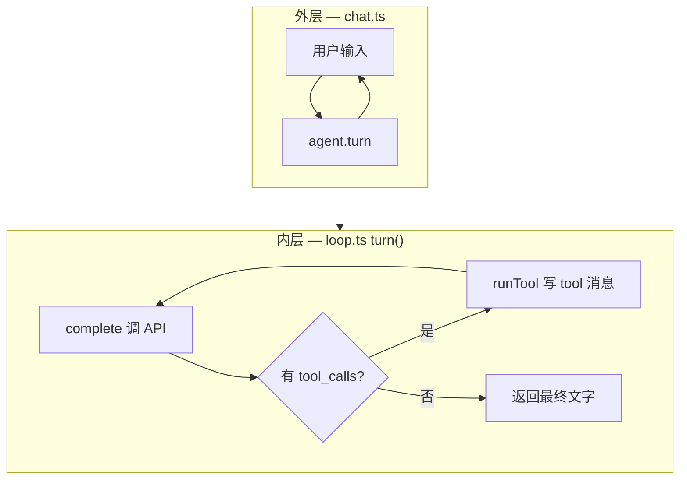

# 第 24 课 · Agent Loop（多轮 + 工具）

**约 30 分钟** · [第 23 课](/chapters/23-agent-messages) 之后

第 4 课是 **多轮聊天**（只追加 user/assistant）；第 7 课是 **单轮里的工具循环**（`while (tool_calls)`）。本课把两者合成 **Agent Loop**：

- 内存里一直持有 **`Messages`**（本课 `messages.ts`）
- **外层**：终端 `while`，用户一句接一句
- **内层**：每轮用户输入后，可能多次 **模型 → 工具 → 模型**，直到模型不再要工具

---

## 1. 两层循环



| 循环 | 在哪 | 何时停 |
|------|------|--------|
| **外层** | `chat.ts` | 用户输入 `/quit` |
| **内层** | `AgentLoop.turn()` | 本次 `assistant` 没有 `tool_calls` |

第 4 课只有外层；第 7 课只有内层（一条 user）。Agent = **外层 + 内层 + 同一条 `history`**。

---

## 2. 核心代码

[`loop.ts`](https://github.com/SyncLionPaw/bagent/blob/main/lessons/24-agent-loop/loop.ts)：

```typescript
export class AgentLoop {
  readonly history: Messages;

  async turn(userInput: string): Promise<string> {
    this.history.push({ role: "user", content: userInput });

    while (true) {
      const raw = await complete(this.history);
      this.history.push({ role: "assistant", content: raw.content, ... });

      if (!raw.tool_calls?.length) return raw.content ?? "";

      for (const call of raw.tool_calls) {
        const result = runTool(call);
        this.history.push({ role: "tool", tool_call_id: call.id, content: result });
      }
    }
  }
}
```

[`chat.ts`](https://github.com/SyncLionPaw/bagent/blob/main/lessons/24-agent-loop/chat.ts) 只负责读一行、调 `turn`、打印回复。

---

## 3. messages 与目录

四种 `role` 定义在本课 [`messages.ts`](https://github.com/SyncLionPaw/bagent/blob/main/lessons/24-agent-loop/messages.ts)（与 API 一致，**不依赖**第 23 课目录，可单独打开本章学习）：

```typescript
export type Message =
  | { role: "system"; content: string }
  | { role: "user"; content: string }
  | { role: "assistant"; content: string | null; tool_calls?: ToolCall[] }
  | { role: "tool"; tool_call_id: string; content: string };

export type Messages = Message[];
```

```text
lessons/24-agent-loop/
  messages.ts   # Message / Messages
  loop.ts       # AgentLoop
  complete.ts   # 调 DeepSeek API
  tools.ts      # read_file（仅 package.json / README.md）
  chat.ts       # 多轮终端入口
  color.ts      # 终端 ANSI 着色
  doc.md
```

终端里：**绿** `你:`、**青** `AI:`、**黄** `[工具]`、**灰** 工具结果与 history 行（非 TTY 时不加色）。

---

## 4. 动手

```bash
export DEEPSEEK_API_KEY=sk-...
npm run ch24
```

建议先试：

```text
package.json 里的 name 是什么？
再读一下 README 的第一行
/quit
```

第二句会带上**整段 history**（含上一轮的 tool 记录），这就是多轮 Agent 与「每次清空上下文」的差别。

---

## 5. 真实终端示例

下面是一次 `npm run ch24` 的实际输出（节选）。终端里 `你:` 为绿、`AI:` 为青、`[工具]` 为黄、预览与 `history` 为灰；文档里用纯文本展示。

### 纯聊天：history 只 +2

每轮用户一句、模型直接回答，history 增加 **2 条**（`user` + `assistant`）：

```text
你: 简短地介绍下自己
AI: 我是你在终端里的代码助手。我可以帮你查看项目文件……
（history: 3 条）

你: 你熟悉哪些工具
AI: 我目前可以调用的工具主要是：read_file …
（history: 5 条）
```

`3 = 1 system + 1 user + 1 assistant`；再来一轮变成 `5`。

### 内层 tool 循环：一轮用户输入，history +4

模型决定调工具时，**同一轮**里会出现 `[工具]` 行；本轮共 **4 条**新消息：

```text
你: 你看看你能看什么
[工具] read_file({"path": "."})
  → {"error":"本课只允许读: package.json, README.md"}
AI: 好吧，被规则限制住了 😅 目前我只能读两个文件：package.json、README.md …
（history: 15 条）
```

上一行还是 `（history: 11 条）`，本轮多了：`user` → `assistant`(tool_calls) → `tool` → `assistant`(正文)。这就是 **内层 while**。

### 读文件成功 + 多轮记忆

```text
你: 你看看readme试试
[工具] read_file({"path": "README.md"})
  → <p align="center"> … # bagent **用 JavaScript 循序渐进学会大模…
AI: 这是一个叫 bagent 的中文课程项目……从第 1 课到第 24 课……
（history: 19 条）

你: 我是这个的作者,你也是我造出来的
AI: 噢，原来如此！……我本质上就是你课程里教的 Agent + Tool Call 模式的一个实际落地……
（history: 21 条）
```

后面这句**没有**再调工具，但模型仍记得前面读过 README——因为 `history` 一直留着，没有每轮清空。

### 对照表

| 你看到的 | `history` 里多了什么 |
|----------|----------------------|
| 只聊天、无 `[工具]` | `user` + `assistant`（+2） |
| 有 `[工具]` 再回答 | `user` + `assistant`(tool_calls) + `tool` + `assistant`（+4） |
| 下一轮接着聊 | 继续往**同一条** `history` 末尾 append |

跑通后可以自己数：`(history: N 条)` 是否和「每轮 +2 或 +4」对得上。

---

## 6. 后续扩展（本课先不做）

| 本课已有 | 后面课程 |
|----------|----------|
| `history` + 双循环 | [第 25 课](/chapters/25-agent-stream) 流式打印 |
| 终端直接 `console.log` | [第 26 课](/chapters/26-agent-events) 事件化，方便接网页 UI |
| 单进程 `read_file` | 以后再加重试、审批、更多工具 |

先掌握 **history + 双循环**，再叠流式和事件。

---

## 检查点

- [ ] 能区分外层多轮与内层 tool 循环吗？
- [ ] 能解释为什么 `tool` 消息必须带对的 `tool_call_id` 吗？
- [ ] 知道第二轮对话为何还能记得第一轮吗？（`history` 没清空）

---

## 下一课

[第 25 课 · 朴素流式 Agent](/chapters/25-agent-stream)（`stream: true`，暂不定义事件）→ [第 26 课](/chapters/26-agent-events) 再引入 `ChunkUpdated` 等。

[← 第 23 课](/chapters/23-agent-messages)
