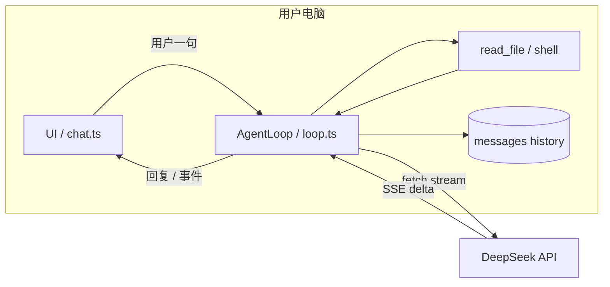

# 第 27 课 · 代码 Agent 的客户端与服务端架构（扩展阅读）

**约 30 分钟** · 纯阅读 · [第 26 课](/chapters/26-agent-events) 之后

你已经写过 [Agent Loop](/chapters/24-agent-loop)、[流式输出](/chapters/25-agent-stream)、并准备 [事件化](/chapters/26-agent-events)。读成熟「终端 / IDE 代码 Agent」产品时，常会问：

- Loop 和 UI 是不是都在我电脑上？
- 是一个进程吗？一个事件循环吗？
- 「客户端」「服务端」到底指谁？

本课用一张地图回答：**默认本地编排 + 云端模型**，但进程数、协议层、UI 形态有多种常见组合。

---

## 1. 先分清两条「线」

不要把「调大模型」和「驱动 Agent」混成一条线。

```text
┌────────────── 用户电脑 ──────────────┐
│  UI（终端 / IDE 面板）                │
│       ↕ 本机进程内 或 stdio IPC       │
│  Agent 内核（Loop、tools、history）     │
└──────────────│────────────────────────┘
               │ HTTPS，常带 SSE 流式
               ▼
        ┌──────────────┐
        │ 模型 API 服务  │  ← 业界常说的「云端 / 服务端」
        └──────────────┘
```

| 线 | 典型协议 | 传什么 |
|----|----------|--------|
| **Agent ↔ 模型** | HTTP + SSE（[第 18 课](/chapters/18-streaming)） | `messages[]`、token 流、`tool_calls` |
| **UI ↔ Agent 内核** | 函数调用、事件、或 JSON-RPC over stdio（[第 17 课](/chapters/17-sse-landscape)） | `ChunkUpdated`、审批、进度 |

[第 20 课](/chapters/20-web-stream-server) 的 Node 网关是第三种：**浏览器 ↔ 你自己的 Node**，Node 再去调模型——Key 不进前端，但 Loop 可以在 Node 里，也可以在浏览器里，取决于你怎么拆。

---

## 2. 「客户端 / 服务端」在 Agent 里指什么

口语里「服务端」常混用，至少三种含义：

| 说法 | 实际指 | 跑在哪 |
|------|--------|--------|
| **模型服务端** | OpenAI / DeepSeek 等 API | 厂商机房 |
| **Agent 服务端** | 你自己写的 Loop + 工具网关 | 本机 Node，或你部署的 VM |
| **UI 客户端** | 终端、IDE 插件、网页 | 几乎总在用户侧 |

成熟 **终端代码 Agent** 的默认姿势是：

- **客户端（UI）**：在你电脑上展示、读键盘  
- **Agent 内核（Loop + tools）**：也在你电脑上  
- **服务端（模型）**：只在云端做推理  

所以：**不是「整个 Agent 在云上远程桌面替你操作」**；是 **本机 Agent 反复请求云端大脑，工具在本地执行**。

---

## 3. 常见架构类型（一张表）

| 类型 | 进程 | Loop 在哪 | UI 在哪 | 工具在哪 | 典型场景 |
|------|------|-----------|---------|----------|----------|
| **A. 单进程终端** | 1 | 同进程 | 同进程（readline / TUI） | 本机 | 本课程 [第 24–25 课](/chapters/24-agent-loop) |
| **B. 单进程 + 事件** | 1 | 同进程 | 同进程，订阅事件流 | 本机 | [第 26 课](/chapters/26-agent-events) 方向 |
| **C. 双进程 + 网络** | 2 | Agent 服务进程 | 客户端进程 | 本机（服务进程执行） | [第 28 课](/chapters/28-agent-network) SSE 传事件 |
| **D. 浏览器 + 本地网关** | 2+ | Node 或浏览器 | 浏览器 | 多在 Node 侧 | [第 20 课](/chapters/20-web-stream-server) |
| **E. 云端沙箱** | 远程 | 厂商 VM 里 | 你本机只显示 | 远程磁盘 / 容器 | 「把任务丢到云上跑」模式 |
| **F. 远程遥控** | 1（本机） | 本机 | 浏览器当遥控器 | 本机 | 算力本地、界面在网页 |

初学只要牢牢记住 **A**：和 [第 24–26 课](/chapters/24-agent-loop) 已写的代码一一对应。产品做大了往往会走向 **B 或 C**。

---

## 4. 是一个进程、一个事件循环吗？

**都在用户电脑上 ≠ 一定是一个进程。**

### 4.1 进程

- **第 24 课 `npm run ch24`**：`chat.ts` + `loop.ts` → **一个** Node 进程。  
- **IDE 插件**：常见 **扩展进程 + Agent 子进程**，中间 stdio / JSON-RPC，**两个**进程，仍都在你笔记本上。

### 4.2 JavaScript 的「事件循环」

在 Node / Bun 里：**每个进程有一个** libuv 事件循环（处理 `fetch`、定时器、I/O 回调）。

```text
一个 Node 进程
  └─ 一个 JS 事件循环
       ├─ readline 等你输入
       ├─ await fetch 等模型
       └─ await turn() 里的 while（async，不阻塞线程）
```

`while (tool_calls)` 是 **业务上的 Agent 循环**，和 OS 的 event loop 不是同一个东西；它在同一个 JS 事件循环上用 `async/await` **协作**。

### 4.3 Agent Loop 和 UI 循环

也是两层逻辑，不必共用一个 `while`：

| | Agent Loop | UI |
|--|------------|-----|
| 干什么 | `messages`、调 API、跑工具 | 输入、流式渲染、按钮审批 |
| 第 24 课 | `loop.ts` 内层 `while` | `chat.ts` 外层 `while` |
| 第 25 课 | 同上 | 流式 `stdout.write` 揉在 `turn()` 里 |
| 第 26 课目标 | `runTurn()` 产出事件 | 终端 / 网页各自 `switch (event)` |

**同进程**时：一个 JS 事件循环，两段逻辑用 async 串起来。  
**双进程**时：两边各有一个事件循环，用 **消息** 对齐（不是共享内存里的同一个 `history` 数组）。

### 4.4 共用一个事件循环，怎么「交错」？渲染何时触发？

这是最容易晕的一点：**一个事件循环 ≠ 同一时刻两件事在并行跑**。JavaScript 在单个进程里基本是 **单线程**——任意一瞬间，调用栈上只有 **一段** 同步代码在执行。

#### 没有真正的「同时」，只有「轮流」

```text
时间 →
│ chat: await rl.question()     │ 等你在键盘敲字（JS 几乎闲着，事件循环等 I/O）
│ chat: await agent.turn()        │ 整段 turn 占住 async 调用链
│   stream: await reader.read()   │ 等网络下一包（JS 又闲着）
│   onToken("你")                 │ 同步执行 → stdout.write ← 这就是一次「渲染」
│   onToken("好")                 │ 再 write 一个字
│   reader.read() …             │ 反复，直到流结束
│ turn 结束                       │
│ chat: 打印 history 行           │
│ chat: await rl.question()     │ 才又能输入
```

**交错**的意思是：网络等待时不会卡死整个进程（`await` 把控制权还给事件循环），但 **第 24–25 课的 `chat.ts` 在 `await agent.turn()` 期间并不能边生成边读你新输入**——外层还在等 `turn` 返回。

要「Agent 跑着还能插嘴」，需要产品级能力（例如 steer、中断、或 UI 在另一进程），不是 `await turn()` 默认就有的。详见 [第 37 课 · 输入循环与 Agent 循环](/chapters/37-two-loops)。

#### 「渲染」在终端里是什么

终端里没有浏览器那种「重绘 DOM」，**终端渲染 ≈ 往 stdout 写字符**：

| 课 | 谁触发写终端 | 何时触发 |
|----|--------------|----------|
| 第 24 课 | `console.log("AI:", reply)` | **整段** `turn()` 结束后 **一次** |
| 第 25 课 | `onToken` → `process.stdout.write` | **每解析出一个** `delta.content` **一次** |

第 25 课相关代码：

```typescript
// loop.ts
const raw = await streamComplete(this.history, (piece) => {
  process.stdout.write(color.ai(piece));  // ← 每个 SSE 片段触发一次
});

// chat.ts
await agent.turn(user);  // turn 没结束，不会回到 question
```

所以流式「打字机」的触发链是：

```text
网卡收到字节 → reader.read() 的 Promise 完成
  → stream.ts 解析出一行 data:
  → 取出 delta.content
  → 调用 onToken(piece)
  → 同步 write 到终端
  → 函数返回，继续 read()
```

**每一次 `onToken` 就是一次微型渲染**；没有单独的「渲染线程」，就在事件循环里顺路执行。

#### 和浏览器的对比（第 18 课）

浏览器里逻辑类似，多了一步 **布局 / 绘制**：

```text
fetch 流 → 解析 chunk → assistant.textContent += piece
  → 浏览器在下一帧 paint（通常 ~16ms 内）
```

事件循环里仍是：chunk 回调 **同步** 改 DOM；**肉眼看到的刷新**由浏览器排版引擎另管。

#### 用 TUI 库（Ink / React 终端）时

若不用裸 `stdout.write`，而是 `setState({ text })`：

- 仍是 **一个** JS 事件循环  
- 每次 state 变 → React 调度一次 **re-render** → Ink 重画终端  
- 触发时机仍是：**收到流式片段 / 事件时** 改 state，不是魔法第二循环

#### 小结：三个「循环」别混

| 名字 | 是什么 | 第 25 课里何时动 |
|------|--------|------------------|
| **libuv 事件循环** | 调度 `await`、I/O 回调 | 一直在；等键盘、等网络时「空转」 |
| **Agent Loop** | `while (tool_calls)` 业务 | `turn()` 从开始到 return |
| **UI 更新** | `write` / `console.log` / 改 state | 非流式：turn 末；流式：**每个 token** |

**一句话**：同进程共用一个事件循环，靠 `await` 在「等 I/O」时让出 CPU；**渲染由「数据到了」触发**——第 25 课是每来一个 `delta.content` 就 `write` 一次，而不是另有一个定时刷新的渲染循环。

---

## 5. 默认本地模式的数据流（对照课程）



和本教程已实现对齐：

| 产品概念 | bagent 对应 |
|----------|-------------|
| Agent 内核 | `AgentLoop` + `complete` / `streamComplete` |
| 会话状态 | `history: Messages` |
| 工具执行 | `tools.ts` → 本机 `readFileSync` |
| 模型调用 | `fetch("…/chat/completions")` |
| 流式 UI | 第 25 课 `onToken`；第 26 课事件 |
| 藏 Key | 第 20 课网关（可选） |

---

## 6. 三种容易误解的说法

| 误解 | 更接近事实 |
|------|------------|
| 「Agent 在云端帮我操作电脑」 | 默认是 **本机** Agent 调 **云端** 模型；工具读的是本机文件 |
| 「Loop 和 UI 必须一个进程」 | 终端常是 1 个；IDE 常是 2 个，仍都在本机 |
| 「一个 Agent 只有一个 while」 | 常有 **外层**（多轮用户输入）+ **内层**（tool 循环）；UI 还可能有独立渲染循环 |
| 「流式 = UI 协议」 | 对模型是 **SSE**；对宿主可以是 **事件 / JSON-RPC**（[第 17 课](/chapters/17-sse-landscape)） |

---

## 7. 和你后续造 Agent 的关系

建议路线（与本课程一致）：

```text
24  单进程 + 双 while + 非流式     ← 最小可跑内核
25  加上 SSE 流式打印               ← 体验像「打字机」
26  事件化 Loop ↔ UI                ← 方便接 IDE / 网页
27  本课：看清行业常见拆法          ← 选型时不懵
28  双进程 SSE 传事件
29  拆开的好处、VS Code 插件怎么接
```

若要把 Loop 和 UI 拆开：**第 28 课** 动手拆，**第 29 课** 讲为什么要拆、插件怎么订阅；stdio JSON-RPC 见第 17 课。若只做网页：**类型 D** + 第 20 课网关。

---

## 检查点

- [ ] 能画出「本机 Agent」和「云端模型」两条线吗？  
- [ ] 能说出单进程终端与 IDE 双进程的区别吗？  
- [ ] 能区分 **JS 事件循环**、**Agent while**、**UI 输入循环** 吗？  
- [ ] 能说出第 25 课「渲染」是 **何时、由谁触发** 的吗？（`onToken` → `write`）  
- [ ] 知道 `await agent.turn()` 期间为何不能同时 `question()` 吗？  
- [ ] 知道第 24 课在整个地图里属于哪一格（类型 A）吗？

---

[← 第 26 课](/chapters/26-agent-events) · [第 17 课 SSE 背景](/chapters/17-sse-landscape)（扩展）
