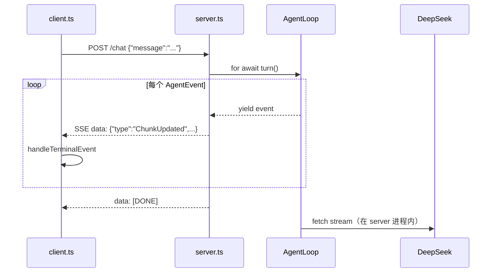

# 第 28 课 · 双进程：网络发布 / 订阅 Agent 事件

**约 35 分钟** · [第 26 课](/chapters/26-agent-events) 之后

第 26 课在同一进程里 `yield` + `for await` 消费事件。本课 **正式拆成两个进程**：

| 进程 | 脚本 | 干什么 |
|------|------|--------|
| **发布端** | `server.ts` | 跑 `AgentLoop`，把每个 `AgentEvent` 用 **SSE** 推到网络 |
| **订阅端** | `client.ts` | `fetch` 订阅流，解析 `data:` 行，`handleTerminalEvent` 画终端 |

对应 [第 27 课](/chapters/27-agent-architecture) 架构表里的 **类型 C（双进程）**，只是通信用 **HTTP + SSE** 而不是 stdio。

---

## 1. 数据流



- **history、tools、API Key** 都在 **server 进程**  
- **client** 只有 readline + 渲染，没有 `DEEPSEEK_API_KEY`

---

## 2. 发布端：`server.ts`

```typescript
for await (const event of agent.turn(message)) {
  res.write(`data: ${JSON.stringify(event)}\n\n`);
}
res.write("data: [DONE]\n\n");
```

- `POST /chat`，body：`{ "message": "用户输入" }`  
- 响应：`Content-Type: text/event-stream`  
- 每一行 `data:` 是一个 **JSON 化的 `AgentEvent`**（与第 26 课同形状）  
- `GET /health` 可看 server 是否在跑、`history` 条数

默认端口 **3028**（与第 20 课 3020 错开）。

---

## 3. 订阅端：`client.ts`

```typescript
const res = await fetch("http://localhost:3028/chat", {
  method: "POST",
  body: JSON.stringify({ message: user }),
});

// 解析 SSE → JSON.parse → handleTerminalEvent
```

与第 18 课相同：**`buf` + `split("\n")` + `data: `**。  
解析出的对象类型仍是 `AgentEvent`，终端渲染逻辑与第 26 课 `terminal.ts` 一致。

环境变量：

- `AGENT_URL`（可选，默认 `http://localhost:3028`）

---

## 4. 与第 26 课对照

| | 第 26 课 | 第 28 课 |
|--|----------|----------|
| 进程数 | 1 | 2 |
| 传递方式 | 内存里 `yield` / `for await` | 网络 SSE |
| 消费代码 | `for await (const e of agent.turn())` | `subscribeTurn` 里解析 SSE |
| UI 位置 | 同进程 `terminal.ts` | client 进程 `terminal.ts` |
| Loop 位置 | 同进程 `loop.ts` | server 进程 `loop.ts` |

**事件类型不用改**——换的是传输层。

---

## 5. 目录

```text
lessons/28-agent-network/
  server.ts      # 发布：AgentLoop → SSE
  client.ts      # 订阅：SSE → terminal
  loop.ts stream.ts events.ts …  # 与 26 同构，跑在 server 侧
  terminal.ts    # 只在 client 用
  doc.md
```

---

## 6. 动手（要两个终端）

**终端 1 — 发布端**

```bash
export DEEPSEEK_API_KEY=sk-...
npm run ch28:server
```

**终端 2 — 订阅端**

```bash
npm run ch28:client
```

试：`package.json 的 name 是什么？` → 应看到与 ch26 类似的流式输出，但 client 进程里没有 Agent 代码。

跑通后终端可以拆成左右两栏（VS Code 分屏即可）：


- **左**：`ch28:server` — 只有 `Agent 发布端 http://localhost:3028`，负责 `POST /chat → text/event-stream`  
- **右**：`ch28:client` — 聊天、`[工具] read_file`、流式 `AI:` 都在 **订阅端** 显示；Loop 与 API Key 在左边进程

---

## 7. 为何用 SSE 传事件

| 方式 | 本课 |
|------|------|
| 内存 `for await` | 第 26 课 |
| **SSE over HTTP** | 第 28 课 — 单向推送，浏览器也能订阅 |
| WebSocket | 双向更强，后续可换 |
| stdio JSON-RPC | IDE 插件常见，见第 17 课 |

一行一个 `data: {AgentEvent}`，调试时 `curl -N` 也能看。

---

## 检查点

- [ ] 能说出 API Key 在哪边进程吗？  
- [ ] 能解释 `data: [DONE]` 与 `TurnEnd` 的区别吗？  
- [ ] 换网页 UI 时，应改 client 还是 server？

---

## 下一课

[第 29 课 · 拆开有什么好处](/chapters/29-agent-split)（扩展）— VS Code 插件等怎么接。

[← 第 26 课](/chapters/26-agent-events) · [第 27 课 架构](/chapters/27-agent-architecture)
