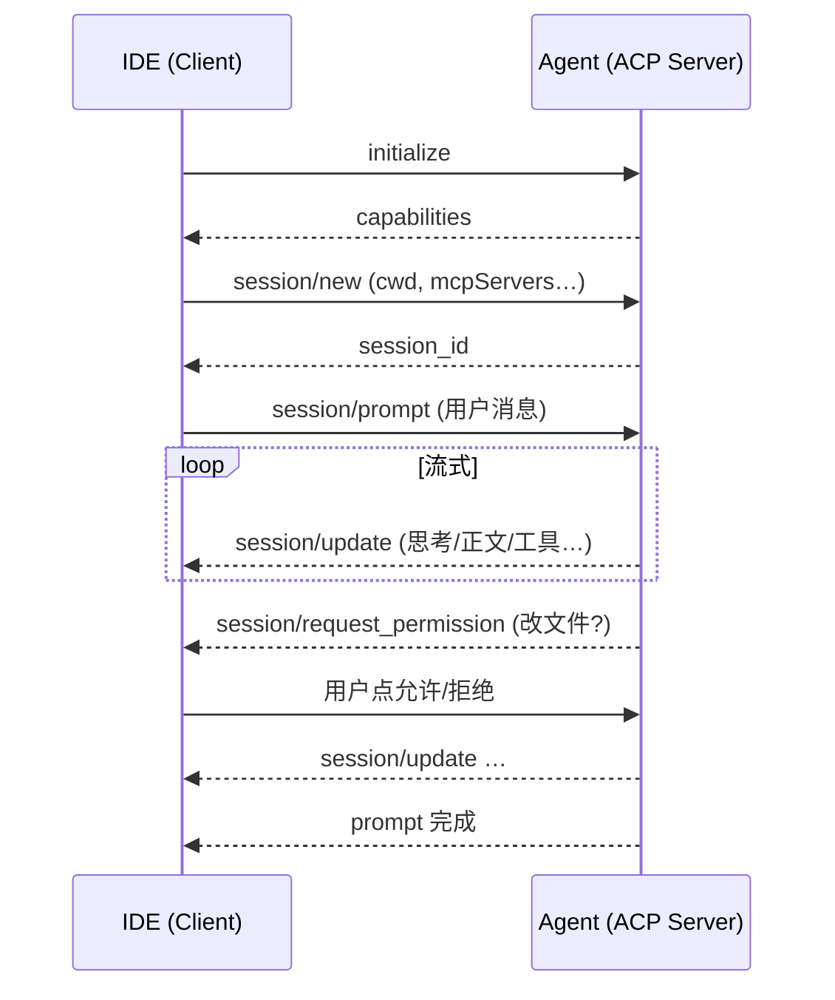

# 第 39 课 · ACP：IDE 怎么连 Agent？

**约 35 分钟** · 纯阅读 · [第 38 课](/chapters/38-agent-product) 之后 · **第四部分开篇**

[第 38 课](/chapters/38-agent-product) 讲了三种产品形态。其中 **IDE 插件**（形态 ②）在 [第 31 课](/chapters/31-vscode-spawn) 用的是 **自家 stdio NDJSON**：一行一条 `AgentEvent`。

本课介绍行业里另一种接法：**ACP**（Agent Client Protocol）——IDE 和 Agent 之间的 **开放标准**。学完你能回答：

- ACP 和 MCP 各管什么？  
- 它和 ch31 的 worker 管道像在哪、差在哪？  
- 为什么 Kimi 用 `kimi acp` 就能进 Zed，而不必给 Zed 单独写插件？

本课 **不写代码**；第四部分动手实现内核与壳时，你会在「自家协议」和「ACP」之间做知情选择。

---

## 1. 一句话

> **ACP = IDE（Client）和编程 Agent（Server）之间的标准「遥控器协议」。**

类比：

| 协议 | 类比 | 连谁 |
|------|------|------|
| **LSP** | 编辑器 ↔ 语言服务 | 补全、跳转、诊断 |
| **MCP** | Agent ↔ 工具 | 读文件、搜库、调 API |
| **ACP** | 编辑器 ↔ Agent | 发任务、收流式回复、弹审批、展示 diff |

MCP 回答「Agent 手里有什么工具」；ACP 回答「**编辑器怎么驱动 Agent、画什么 UI**」。

---

## 2. 为什么需要 ACP

没有标准时，每家 Agent 要给每家 IDE **单独写集成**：

```text
Zed ──定制──► Claude Code
Zed ──定制──► Kimi
JetBrains ──定制──► Codex
VS Code ──定制──► Copilot …
```

**N 个编辑器 × M 个 Agent = 集成爆炸。**

ACP 的目标和 LSP 一样：**Client 和 Agent 各实现一次协议，就能即插即用**。

规范：[Introduction](https://agentclientprotocol.com/get-started/introduction)、[GitHub](https://github.com/agentclientprotocol/agent-client-protocol)。  
谁在做 Client？见官方 [Clients 列表](https://agentclientprotocol.com/get-started/clients)（持续更新）。

---

## 3. 谁在做 Client？（生态一览）

ACP 不只是「Zed 连 Kimi」。官方 [Clients](https://agentclientprotocol.com/get-started/clients) 页列的是 **整个 Client 生态**：编辑器、桌面壳、网页、手机、IM 机器人、框架 adapter、传输桥接。

```text
                    ┌─────────────────────────────────────┐
                    │  ACP Clients（各种壳，只实现协议）      │
                    │  IDE · TUI · Web · 手机 · 飞书/Slack… │
                    └──────────────────┬──────────────────┘
                                       │ spawn / WebSocket / 桥接
                                       ▼
                    ┌─────────────────────────────────────┐
                    │  Agent（ACP Server）                 │
                    │  kimi acp · codex · …               │
                    └──────────────────┬──────────────────┘
                                       │ MCP（可选）
                                       ▼
                              工具服务 / 文件 / DB …
```

记住分工：**Client 画 UI，Agent 产结构化事件**——和 [第 37 课](/chapters/37-two-loops)、[第 38 课](/chapters/38-agent-product) 一致。

按官方分类，和本课最相关的摘录如下（完整列表以官网为准）：

### 3.1 编辑器与 IDE

| Client | 说明 |
|--------|------|
| [Zed](https://zed.dev/docs/ai/external-agents) | 原生支持外部 Agent，`agent_servers` 配 `kimi acp` 等 |
| [JetBrains](https://www.jetbrains.com/help/ai-assistant/acp.html) | AI Assistant 通过 ACP 接外部 Agent |
| **VS Code** | 经 [vscode-acp](https://github.com/formulahendry/vscode-acp) 扩展接 ACP Agent |
| Neovim | CodeCompanion、agentic.nvim 等插件 |
| Emacs | [agent-shell.el](https://github.com/xenodium/agent-shell) |

→ 对应 [第 38 课](/chapters/38-agent-product) **形态 ②**：壳在 IDE，Agent 是子进程。

### 3.2 CLI / TUI

[acpx](https://github.com/openclaw/acpx)、[Nori CLI](https://github.com/tilework-tech/nori-cli) 等是 **通用 ACP Client**——在终端里连任意 ACP Agent，自己当「遥控器」。

→ 和 `kimi` **自带 TUI** 不同：`kimi` 是 Agent+壳一体；acpx 是 **只实现 Client 侧** 的第三方工具。

### 3.3 桌面与 Web

[ACP UI](https://github.com/formulahendry/acp-ui)、[DeepChat](https://github.com/ThinkInAIXYZ/deepchat) 等是 **自带界面的 ACP Client**。

→ 对应 **形态 ③**：也可以像 [第 28 课](/chapters/28-agent-network) 那样用 HTTP/SSE + 自家 `AgentEvent`，或用 [ACP to AG-UI](https://github.com/namanrajpal/acp-to-agui) 等桥接。

### 3.4 消息渠道

[Lark ACP](https://github.com/4t145/lark-acp)、[OpenACP](https://github.com/Open-ACP/OpenACP) 等把 **飞书 / Slack** 变成 ACP Client。

→ 说明：**任何能发 JSON-RPC、能展示流式和审批的宿主** 都可以当 Client，不限于 IDE。

### 3.5 框架与桥接

| 项目 | 作用 |
|------|------|
| [fast-agent-acp](https://fast-agent.ai/acp/)、[@mastra/acp](https://mastra.ai/docs/agents/acp) 等 | 把 Agent 运行时 **暴露成 ACP Server** |
| [ACP to AG-UI](https://github.com/namanrajpal/acp-to-agui) | ACP → AG-UI 事件 + SSE → 网页 |
| [ACP Remote](https://github.com/vcoderun/acpkit/tree/main/packages/transports/acpremote) | stdio Agent 转 WebSocket |

---

## 4. 传输：和 ch31 很像，消息格式不同

本地最常见是 **stdio + 逐行 JSON**——和 [第 31 课](/chapters/31-vscode-spawn) 同一类管道：

```text
┌─────────────┐                              ┌─────────────┐
│ IDE Client  │  spawn: kimi acp             │ Agent 进程  │
│（Zed 等）    ├─────────────────────────────►│             │
│             │  stdin  ◄── Client 发请求     │  loop 内核  │
│             │  stdout ──► Agent 回响应/通知  │             │
│             │  stderr     日志（不能污染 stdout）│             │
└─────────────┘                              └─────────────┘
```

| | **ch31 worker** | **ACP** |
|--|-----------------|---------|
| 编码 | 一行一条 JSON | 一行一条 **JSON-RPC 2.0** |
| 消息名 | 自家 `AgentEvent`、`{ op: "chat" }` | `session/new`、`session/prompt`… |
| 谁能当 Client | 本教程的 VS Code 插件 | **任何**实现 ACP 的 IDE / 工具 |
| 审批 | Webview 解析 `ToolCallPending` | `session/request_permission` |

规范要求：Agent **不能把非协议内容写到 stdout**；调试日志走 **stderr**（和 MCP stdio 一样）。

---

## 5. 一次对话里发生什么

抓住三条：**生命周期、流式、权限**。



和 [第 36 课](/chapters/36-tool-hooks) 内核的对应（概念层，字段不必一一相等）：

| ACP 侧 | bagent 内核 |
|--------|-------------|
| `session/prompt` | `turn(user, approve)` |
| `session/update` | `AgentEvent` 流 |
| `session/request_permission` | `ToolCallPending` + `approve()` |
| `session/new` 的 `mcpServers` | 将来接 MCP（本教程尚未展开） |

**UI 在 IDE**：聊天、diff、审批按钮都是 Client 画的；Agent 不抢 TTY。

---

## 6. ACP 与 MCP：别混

```text
        ┌──────────┐
        │   IDE    │
        │ (Client) │
        └────┬─────┘
             │ ACP
             ▼
        ┌──────────┐         MCP          ┌──────────┐
        │  Agent   │ ◄────────────────► │ 工具服务  │
        │ (Server) │                    │ 文件/DB… │
        └──────────┘                    └──────────┘
```

| | **ACP** | **MCP** |
|--|---------|---------|
| 方向 | IDE **驱动** Agent | Agent **调用** 工具 |
| 典型 Client | Zed、JetBrains | 各类 Agent 宿主 |
| 典型 Server | `kimi acp`、Codex CLI | filesystem server 等 |

`session/new` 可声明 Agent 应连哪些 MCP Server——**一次握手配好「编辑器→Agent」和「Agent→工具」**。

---

## 7. 实例：Kimi 的三种壳

[Kimi Code CLI](https://moonshotai.github.io/kimi-code/zh/guides/getting-started.html) 和 [第 38 课](/chapters/38-agent-product) 三种形态一一对应：

| Kimi | 对应形态 |
|------|----------|
| `kimi` 终端 TUI | ① CLI |
| `kimi acp` → Zed / JetBrains | ② IDE（**不靠 Kimi 给每家 IDE 写插件**） |
| `kimi web` | ③ 自有 UI |

Zed 配置示例（摘自 Kimi 文档）：

```json
{
  "agent_servers": {
    "Kimi Code CLI": {
      "type": "custom",
      "command": "kimi",
      "args": ["acp"],
      "env": {}
    }
  }
}
```

IDE 启动子进程走 ACP；需先在终端 `kimi login`，否则 server 回 `AUTH_REQUIRED`（错误码 `-32000`）。

---

## 8. 两种接法：ch31 自家协议 vs ACP

[第 31 课](/chapters/31-vscode-spawn) 和 ACP **都是 stdio 子进程**，差别在 **消息是不是行业标准**：

```text
ch31 worker                    ACP
────────────                   ────
spawn + NDJSON                 spawn + JSON-RPC
AgentEvent 自己定义              session/* 规范定义
只为本教程插件服务               Zed / JetBrains / vscode-acp 都能连
```

| 你若要… | 更常选 |
|---------|--------|
| 跟课、完全掌控事件名与字段 | **ch31 式**自家 `AgentEvent`（先学原理） |
| Agent 能被 Zed 等 **现成 IDE** 拉起 | **ACP Server**（如 `xxx acp`） |
| 自己的网页 UI | **ch28 SSE + AgentEvent**；或 ACP + 桥接 |
| 内核代码 | **同一份** `loop`；最外层加 **adapter** 即可 |

```text
loop · events · hooks · tools
        │
        ├── adapter/stdio-events   → ch31 插件
        ├── adapter/acp            → 对接 Zed 等
        ├── adapter/sse-server     → ch28 / 网页
        └── adapter/tui            → CLI
```

adapter 把 `session/update` **映射**成内部 `AgentEvent`（或反过来），**不必重写 Loop**。

---

## 9. ACP 能做什么、不能做什么

**能标准化：**

- IDE 与 Agent 的 **集成接口**  
- **多 session**、流式、权限请求  
- Agent 不必为每个 IDE 各写专用插件  

**不能代替你学：**

- Agent **内核**怎么写（仍是 ch24–36 的 `loop`）  
- **终端 TUI**（`kimi` 自己的壳，不是 ACP）  
- **审批策略、工具列表**——ACP 只规定 **怎么传**，不规定 **批什么**  

---

## 10. 和 Cursor 的关系

**Cursor** 深度集成在自家产品里，**不依赖 ACP**。本教程的目标是 **看懂可拆内核 + 多壳**，不是复刻 Cursor。

学完协议分层，你应能说出：

```text
MCP   →  Agent 怎么调工具
ACP   →  IDE 怎么驱动 Agent
AgentEvent（ch26）→  本教程内核对内的事件名；可映射到 ACP 或 SSE
```

第四部分会先 **抽内核、对齐 ch36**，再视需要加 ACP adapter——**理解本课是写代码前的地图**。

---

## 检查点

- [ ] ACP 全称？和 MCP 各连哪两端？  
- [ ] 本地 ACP 默认用什么传输？stdout 为什么不能打日志？  
- [ ] `session/prompt` 大致对应内核哪段逻辑？  
- [ ] `kimi acp` 对应第 38 课哪种形态？  
- [ ] ch31 NDJSON 与 ACP 相同点和不同点？  
- [ ] 自有网页 UI 为什么常用 SSE 而不是 ACP stdio？  
- [ ] [Clients](https://agentclientprotocol.com/get-started/clients) 里 VS Code 怎么接 ACP？

---

[← 第 38 课](/chapters/38-agent-product) · [第 31 课](/chapters/31-vscode-spawn) · [第 28 课](/chapters/28-agent-network) · [第 37 课](/chapters/37-two-loops)
